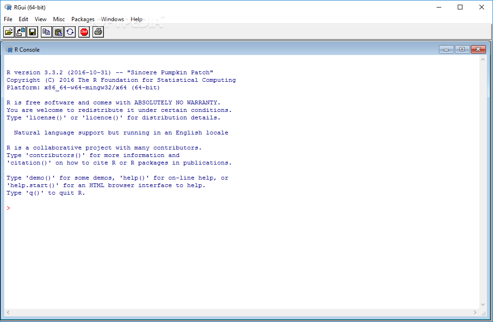

This document provides instructions for downloading and installing R and RStudio on a Windows machine. (Note: I do not personally own a Windows machine so some of these instructions might be outdated. If the installation instructions you face are different from what is outlined here, please let me know.)

## Before you start

Make sure that you have about 500 MB of free space on your machine. We will need this space to install both R and RStudio, and when the program installs the compressed files expand to take much more space.

## Installing R

1. Go to [this website](https://cran.r-project.org/bin/windows/base/).

2. Click on the "Download R 3.5.1 for Windows" link at the top of the page. Your download should start.

3. Once the file has been downloaded, click on it: it will unpack and copy all the files to your hard drive. (If you run into any issues, consult the FAQ sections in the link above.)
  - ACCEPT the default startup options.
  - YES to a Start Menu folder, and
  - YES to a desktop icon and to a Quick launch icon.

R is now **installed** on your computer.  

**Note**: This version of R should run with no problems on Windows XP and later.

### Testing R

1. Double-click on the R desktop shortcut. A window looking something like this should pop up:

<center>{width=50%}  
*Source: http://i1-win.softpedia-static.com/screenshots/R-for-Windows_7.png *</center>  
\
The `>` character is called the prompt and is the place where we enter commands for the program to interpret. For instance, if you type `25+26` followed by the return/enter key, you will see:

```{r}
25+26
```

2. To quit R, call the quit function by typing `q()` and htting the return key.

```{r, eval=FALSE}
q()
```

R will ask you if you want to save your work. Don't save it. You have now left R.

We are not going to use R this way often, as we will use an integrated environment called RStudio.

## Installing RStudio

1. Go to [this website](https://www.rstudio.com/products/rstudio/download/#download).

2. Click on the "RStudio 1.1.456 - Windows Vista/7/8/10" link. The file download will begin.

3. Once the file has been downloaded, click on it and walk through the installation process.

  - YES to the question on whether you want to allow this app to make changes to your device.
  - Choose Install Location: `C:\Program Files\RStudio`.

RStudio is now **installed** on your computer.

**Note**: For RStudio to work, R needs to be installed first.

### Testing RStudio

1. Double-click on the RStudio icon in the Applications. A window titled "RStudio" should pop up, looking something like this:

<center>{width=50%} 

*Source: https://slobaexpert.files.wordpress.com/2014/02/image35.png *</center>
\  

2. Just as in R, the `>` character in the Console window is where we enter commands for the program to interpret.  

3. To exit RStudio, click on the red X at the top-right corner of the window. If prompted to save the workspace, do not save it.

## A note about filenames in Windows

In the Windows system, path names use backslashes, e.g. `C:\Users\username\RWork\`. R, on the other hand, inherits its file and folder naming conventions from Unix which uses forward slashes instead: `C:/Users/susan/RWork/`.  

In Unix conventions, backslashes are actually used for a different purpose (to isolate special characters and stop them from being immediately interpreted).

As a rule, to avoid problems, we should avoid naming directories and files with spaces and special characters.

If you already have an important directory with a space in its name, know that when trying to reference that directory in R, you have to put a backslash in front of each space.

**Note**: ("C:\\Path\\To\\A\\File") is the same as ("C:/Path/To/A/File").

