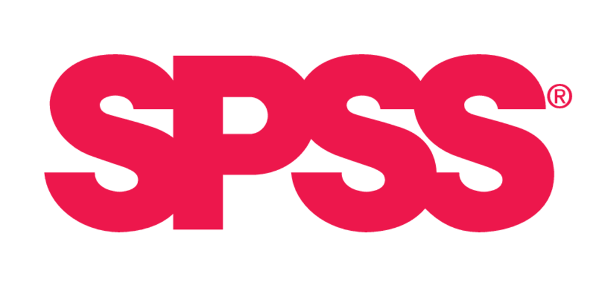
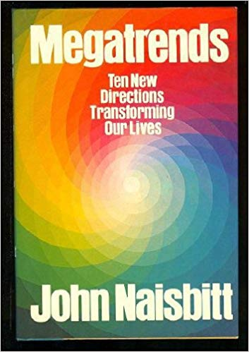
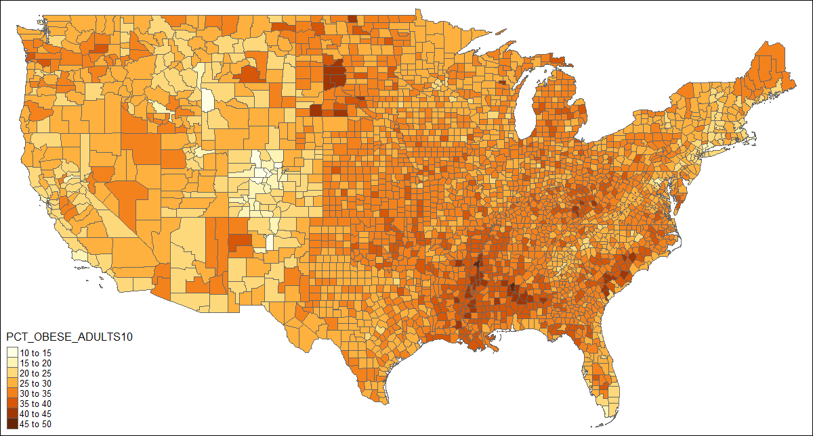
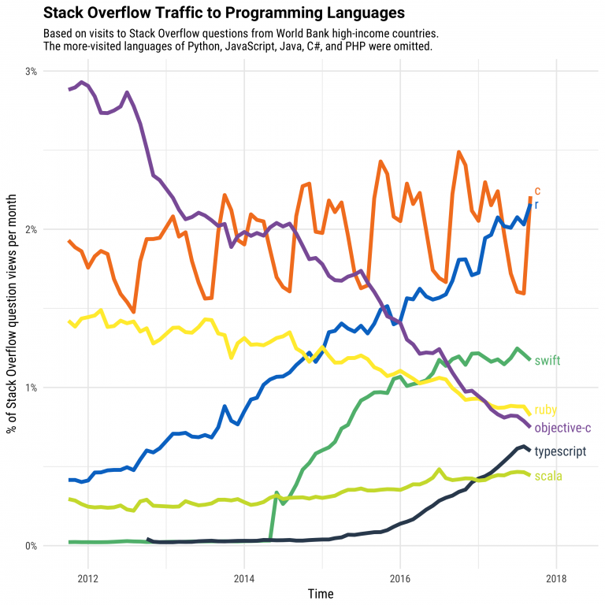
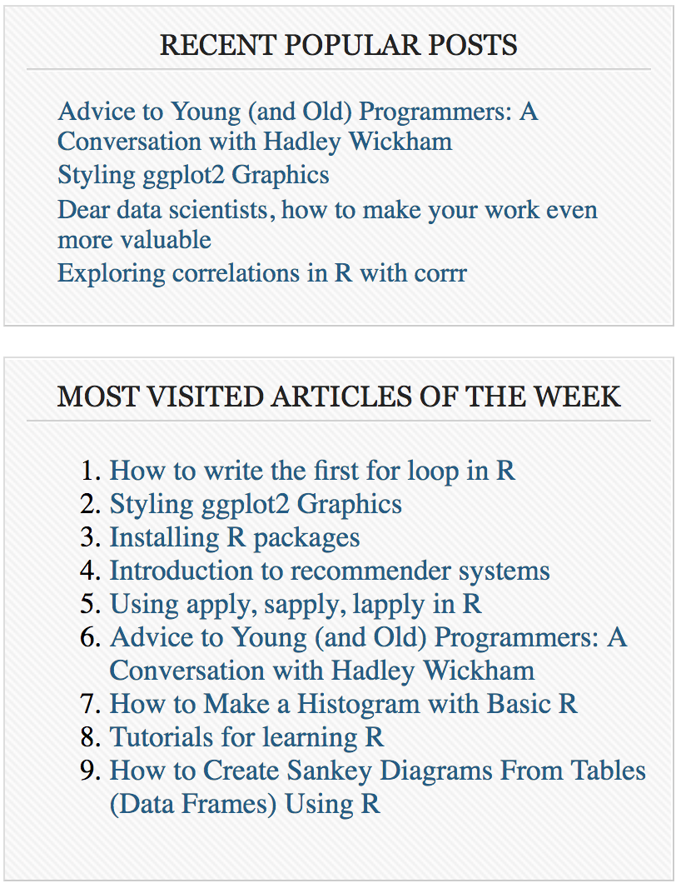
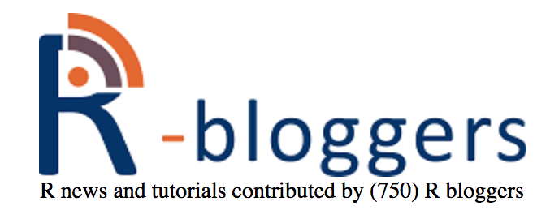
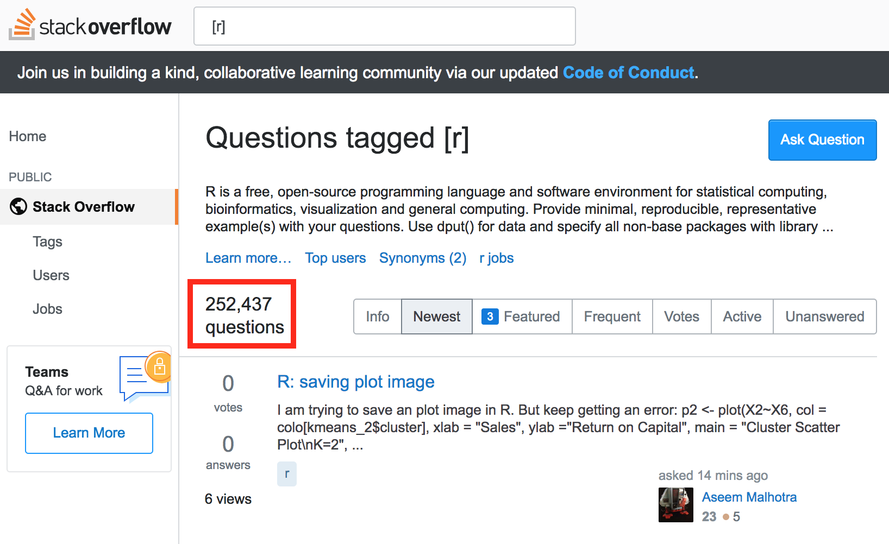
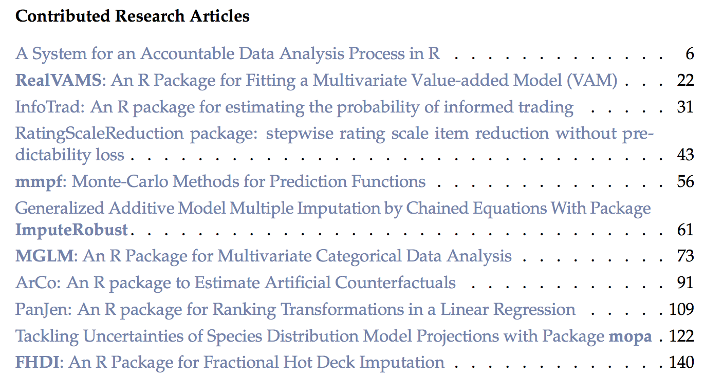
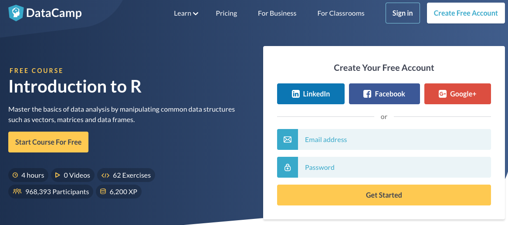

# Agenda for today
- Course overview: Why learn R?
- Class logistics
- Variable types
- Vectors, matrices and lists

# The big data explosion
<div class="column-left">
- John Naisbitt (1982): “We are drowning in information but starved for knowledge.”  
- We need computing tools to make sense of data

\
<center>
{width=20%} {width=40%}
\
{width=20%}   {width=20%} {width=20%}
</center></div>

<div class="column-right">
<center>{width=90%}</center>
</div>

# What is R?
- **S programming language:** Developed in the mid-1970s in Bell Labs
    - An interactive approach to statistical computing: *"... to turn ideas into software, quickly and faithfully"*
    - Specifically designed for data analysis and graphics
- **R** is a version of S, with some ideas inspired by Scheme
- Created by **R**oss Ihaka and **R**obert Gentleman at the University of Auckland, New Zealand
- Conceptualized in 1992, announced on S-news mailing list in Aug 1993, initial version released in 1995, 1st stable version in 2000
- Currently developed by the *R Development Core Team*

<center>
{width=15%}  {width=15%}
<div class="caption">Ross Ihaka & Rob Gentleman</div></center>
</center>

# Why learn R?
### Reason #1: R was specifically designed for statistics and data analysis.  

- Many features to aid data analysis which other programming languages don't have  
- Interactive, well-suited for exploratory data analysis and rapid prototyping  
- Good graphical capabilities  

<div class="column-left-equal">
<center>
{width=80%}
<div class="caption">Map of US obesity rates (Source: [stackoverflow.com](https://stackoverflow.com/questions/23714052/ggplot-mapping-us-counties-problems-with-visualization-shapes-in-r))</div></center></div>

<div class="column-right-equal">
<center><video width=80% controls>
  <source src="Images/CLT Demo.mp4" type="video/mp4">
Your browser does not support the video tag.
</video>
<div class="caption">Demo of the Central Limit Theorem (Source: [yihui.name](https://yihui.name/animation/example/clt-ani/))</div>
</center></div>

# Why learn R?
### Reason #2: It's popular!

<center>{width=50%}
<div class="caption">(Source: [stack overflow](https://stackoverflow.blog/2017/10/10/impressive-growth-r/))</div>
</center>

# Why learn R?
### Reason #3a: It's easy to get started with R.  

<div class="column-left-equal">
- Open source: free!
- Several [online tutorials](https://www.r-bloggers.com/how-to-learn-r-2/)
- Active community developing "packages"
    - Shared for free on The Comprehensive R Network ([CRAN](https://cran.r-project.org/))
    - As of 30 Sep 2018: **13,127** packages hosted on CRAN
- Several online resources available
</div>

<div class="column-right-equal">
<center>
{width=80%}
<div class="caption">(Source: [Revolution Analytics](http://blog.revolutionanalytics.com/2017/01/cran-10000.html))</div>
</center></div>

# Why learn R?
### Reason #3b: RStudio

- Open-source integrated development environment (IDE) for R  
- Several features which make programming and data analysis easier

<center>{width=70%}</center>

# Why learn R?
### Reason #3c: Community

- Active online community (package development, online discussion and Q&A)  
- Physical meet-ups
    - Full list [here](https://jumpingrivers.github.io/meetingsR/index.html)
    - [Bay Area useR Group](https://www.meetup.com/R-Users/)
    - [R-Ladies San Francisco](https://www.meetup.com/rladies-san-francisco/)

# [R-bloggers](https://www.r-bloggers.com/)

<div class="column-left">
Blog aggregator of content contributed by bloggers who write about R

<center>{width=60%}</center> 
</div>

<div class="column-right">
<center>{width=80%}</center>
</div>

# [Stack Overflow](https://stackoverflow.com/)

Q&A site for programmers

<center>{width=80%}</center>

# The challenge of learning R
- *"By statisticians for statisticians"*: very different from other programming languages
- Language evolves over time: have to keep up
- Many different ways to do the same thing

```{r include=FALSE}
data(mtcars)
df <- mtcars
library(dplyr)
```

```{r eval=FALSE}
df[df$mpg > 30,]
with(df, df[mpg > 30,])
subset(df, mpg > 30)
filter(df, mpg > 30)
df %>% filter(mpg > 30)
```

# Course objectives
By the end of this course, students will be able to:  

- Navigate the R ecosystem at a basic level (RStudio, CRAN, R markdown, documentation)  
- Open, manipulate, plot and save data  
- Perform simple data modeling and statistical analyses in R

# Tentative overview of the course
- **Week 1**: Introduction to RStudio, basic objects in R
- **Week 2**: Plotting and transforming data
- **Week 3**: Importing, cleaning and publishing data
- **Week 4**: Applications (map-making, data modeling)

# Class logistics
<div class="column-left">
- 8 sessions over 4 weeks (Weeks 2-5)
- TTh 12 - 1:20pm, 380-380Y
- Instructor: Kenneth Tay
    - Born and raised in Singapore
    - AB in Mathematics, Princeton University 2010
    - Work experience with Singapore Government: defense, environment, data science
    - 3rd-year PhD student in Statistics
</div>
<div class="column-right">
<center>{width=70%}</center>
</div>

# Class logistics
- **Bring your laptop to class!**
- Course website: [https://web.stanford.edu/~kjytay/courses/32-2018/](https://web.stanford.edu/~kjytay/courses/32-2018/)
- Office hours: Fridays 10am - 12pm, Sequoia Hall Room 207
- Recommended text: [*R for Data Science*](http://r4ds.had.co.nz/) by Garrett Grolemund and Hadley Wickham  

### Assignments  

- Final project proposal (due Oct 19): 20%
- Final project (due Nov 2): 80%
- Programming exercises (ungraded)

# What is a variable?

- An "envelope" or "bucket" where information can be stored and referenced
- An abstraction that allows us to deal with the underlying structure and relatioships
- Each "bucket" has a name on the outside, contains information inside
    - **Variable name:** name of the bucket
    - **Variable value:** information on the inside
- **Variable assignment:** process of putting information inside a bucket

```{r eval=FALSE}
x <- 3
y <- "abc"
x <- y
```


# Variable types
- Every programming language has the notion of data **types**
- Common types
    - integer (..., -1, 0, 1, 2, ...) 
    - double (real numbers), 
    - character ("a", "R is cool", "the quick brown fox...", "1")
    - Boolean (`TRUE` or `FALSE`)
- **The object's type determines what operations can be done with it**
    - E.g. You can add 2 numbers, but can you add a number and a letter?

# Confusion: 123 vs. "123"

How to differentiate between numeric variables and character variables which consist of digits?

- *Should I treat it as a number like I do in math?*
    - e.g. *Does it make sense to add 2 of them together?*
    - e.g. *Does it make sense to compare their relative sizes?*
- Numeric variables: counts, age, ...
- Character variables: Phone numbers, ZIP codes, ...

# Let's try R!
- Open RStudio on your laptop
- If you don't have RStudio yet: [http://rextester.com/l/r_online_compiler](http://rextester.com/l/r_online_compiler)


----
<br><br><br><br><br><br><br><br>
<font size = 36><b>Optional material</b></font>

# [The R Journal](https://journal.r-project.org/)

Bi-annual open-access journal: Features short to medium length articles covering topics of interest to R users and developers

<center>{width=80%}</center>

# [R-exercises](http://www.r-exercises.com/start-here-to-learn-r/)
<div class="column-left">
Website with both tutorials and exercises

<center>{width=80%}</center>
</div>

<div class="column-right">
<center>{width=50%}</center>
</div>

# [DataCamp](https://www.datacamp.com/)

Website for learning data science, R included (some courses free, some not)

<center>{width=90%}</center>
</div>