# Gear Up for Social Science Data Extravaganza

- Oct 19 (Fri), Graduate School of Business Library & Green Library  
- Various activities from 10am - 5pm  
- Data talks & training, data expo, data analysis demos
- More information here: https://events.stanford.edu/events/805/80540/

<center>{width=30%}</center>

# Recap of session 1

- R as calculator
- Types of variables in R
    - Numeric (integer, double)
    - Character/string
    - Boolean (`TRUE` or `FALSE`)
- Homogeneous data structures 
    - Vectors: 1D array, elements of same type 
    - Matrices: 2D array, elements of same type
- Heterogeneous data structures
    - Lists: Collection of key-value pairs, value can be anything

# Vectors

- Can be created using the `c()` function, or using the `:` shortcut
- Elements in a vector have to be of the same type

```{r}
vec <- c(10, 5, 20)
```

```{r}
vec <- 1:10 * 2
vec
```

- To extract a subset of elements by their indices, put a vector of indices in square brackets:
```{r}
vec[c(1,5)]
```

# Lists

- A collection of key-value pairs
- Created with the `list()` function

```{r}
cars <- list(make = "Honda", 
             models = c("Fit", "CR-V", "Odyssey"), 
             available = c(TRUE, TRUE, TRUE))
```

- `[[` or `$` notation to refer to a specific key-value pair

```{r}
cars$make
cars[["models"]]
```


# Agenda for today
- Data frames  
- 3 types of syntax in R  
- Functions and packages

# What is a data frame?

- A **data frame** is R's data structure for storing datasets
    - First row: variable/covariate/feature names
    - Each subsequent row represents one observation
    - Each column contains the values of that variable across observations
- **Tibbles**: A data frame with some cosmetic changes

<center>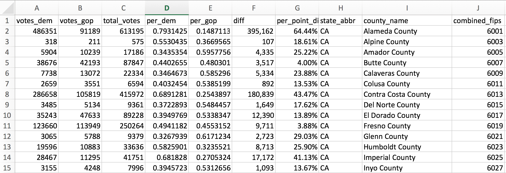{width=90%}
<div class="caption">Example of a dataset</div></center>

# R's syntax for creating data frames

<center>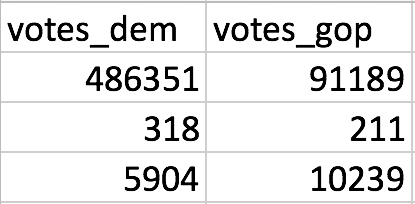{width=20%}</center>

```{r}
df <- data.frame(votes_dem = c(486351, 318, 5904), 
                 votes_gop = c(91189, 211, 10239))
df
```

# Data frames "under the hood"

- To R, a data frame is simply a special type of list!
    - Keys of the list are the variable/covariate names
    - Values are vectors of the same length
- Because it is special, data frames have some additional functionality

```{r}
is.list(df)
df$votes_dem
```

# R's syntax  

3 different types of syntax:  

- **Function syntax**  
- `+` syntax for plotting with `ggplot2` (Session 3)  
- `%>%` syntax for transforming data with `dplyr` (Session 4)  

# Functions: R's workhorse

A **function** is a named block of code which  

- Takes in 1 or more inputs from the user,  
- Performs a specific task, and  
- Returns an output to the user.

<div class="column-left-equal">
<center>
{width=50%}
<div class="caption">(Source: [practicalli.github.io](https://practicalli.github.io/clojure/thinking-functionally/pure-functions.html))</div></center></div>

<div class="column-right-equal">
<center>{width=80%}
<div class="caption">(Source: [codehs.gitbooks.io](https://codehs.gitbooks.io/introcs/content/Basic-JavaScript-and-Graphics/functions-and-return-values.html))</div>
</center></div>

# We use functions in R all the time

We've already seen a number of functions in R! For example,
```{r}
is.character("123")
```

The function `is.character` takes the input given to it in the parentheses and returns `TRUE` or `FALSE`, depending on whether the input is of type character or not.

Others we've seen: `str`, `log`, `typeof`, `rm`, `c`, `list`, `length`, ...

We can see what a function does by typing in `?` followed by the function name in the R console.

```{r eval=FALSE}
?is.character
```

# Structure of an R function call
A function call consists of:

- Function name
- Parentheses, and 
- A list of arguments within the parentheses
    - Options that change what the function does slightly

# `mean()`: An example  

Take the mean of `c(1,3,NA)`.

<div class="column-left-equal">
```{r}
mean(c(1,3,NA))
```
<center>{width=80%}</center>
</div>

<div class="column-right-equal">

```{r}
mean(c(1,3,NA), na.rm = TRUE)
```

<center>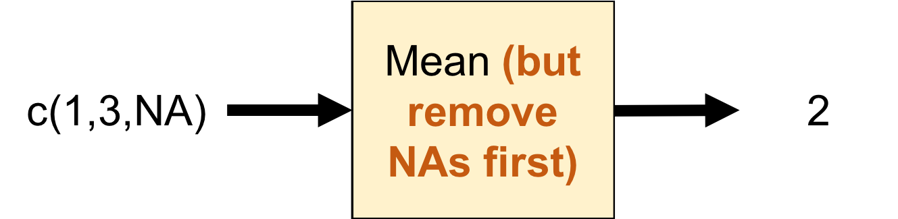{width=80%}</center>
</div>

# `sample()`: Description

<center>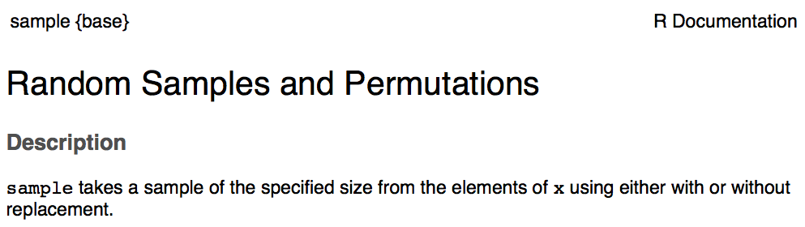{width=90%}</center>

# `sample()`: Usage

<center>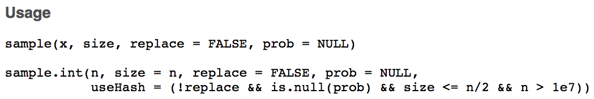{width=90%}</center>

What comes after the `=` sign: default value for that argument

# `sample()`: Arguments

<center>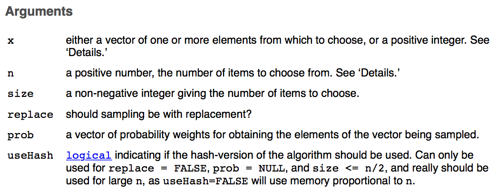{width=90%}</center>

# `sample()`: Details

<center>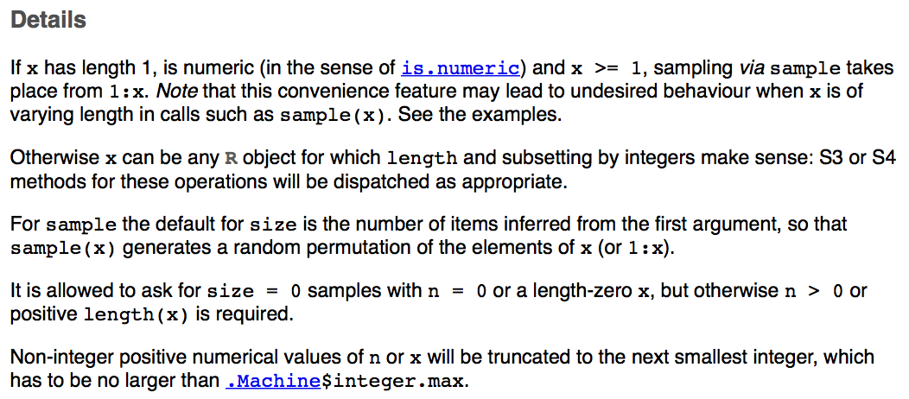{width=90%}</center>

# `sample()`: Value

<center>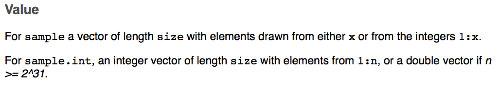{width=90%}</center>

# How does R know which arguments we are referring to?
<center>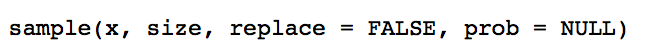</center>

```{r}
sample(x = 1:10, size = 10)
```

```{r}
sample(1:10, 10, TRUE)
```

```{r}
sample(size = 5, 1:10)
```


# Functions can be "chained" together

Commands are evaluated "from inside out"

```{r}
is.character(as.character(123))
```

<center>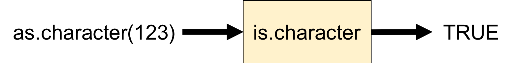{width=80%}</center>

# Packages

- Many people around the world are trying to do the same thing, why not share code?
- A **package** is a collection of R functions, data, documentation and tests
- Hadley Wickham: "the fundamental unit of shareable code"
- R comes in-built with a core set of packages
    - E.g. `base`, `datasets`, `graphics`, `stats`
- Most user-created packages are available on The Comprehensive R Archive Network ([CRAN](https://cran.r-project.org/))
    - Packages are generally well-maintained and have good documentation
    - As of 3 Oct 2018, there are **13,122** packages available on CRAN
- For packages related to bioinformatics, see [Bioconductor](http://www.bioconductor.org/)

# Today's dataset: Fuel economy

<center>{width=85%}
<div class="caption">(Source: [SuperCars](http://www.thesupercars.org/top-cars/most-fuel-efficient-sports-cars-top-10-list/))</div>
</center>

# `fueleconomy`: Package information on [CRAN](https://cran.r-project.org/)

<center>https://cran.r-project.org/web/packages/fueleconomy/index.html

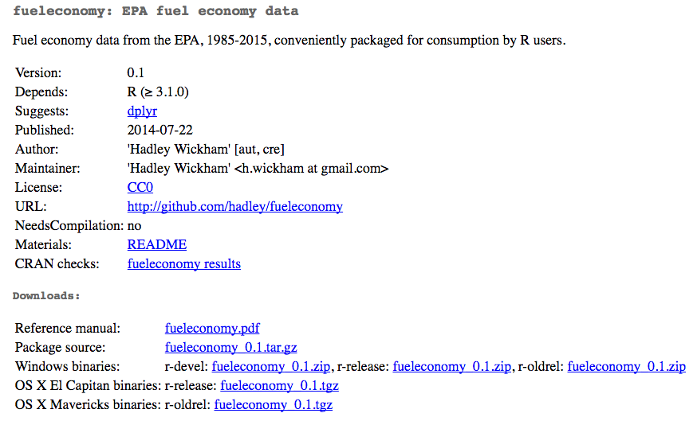</center>

----
<br><br><br><br><br><br><br><br>
<font size = 36><b>Optional material</b></font>

# Why use functions?
## Reason #1: Functions make code more understandable.

- Both for others and for you (6 months down the road)

**Example**: What is the line of code below trying to do?
```{r eval=FALSE}
x <- c(4, 234, 1, 50, 764)
x <- (x - min(x)) / (max(x) - min(x))
#> [1] 0.003931848 0.305373526 0.000000000 0.064220183 1.000000000
```

```{r}
rescale01 <- function(x) {
  (x - min(x)) / (max(x) - min(x))
}
rescale01(c(4, 234, 1, 50, 764))
```

# Why use functions?
## Reason #2: Functions make code more concise.

- **DRY** principle: **D**on't **R**epeat **Y**ourself
- Minimize chance of making errors

```{r eval=FALSE}
list$a <- (list$a - min(list$a)) / (max(list$a) - min(list$a))
list$b <- (list$b - min(list$b)) / (max(list$b) - min(list$b))
list$b <- (list$c - min(list$c)) / (max(list$c) - min(list$c))
```

vs.

```{r eval=FALSE}
list$a <- rescale01(list$a)
list$b <- rescale01(list$b)
list$c <- rescale01(list$c)
```

Can you spot the mistake in the first block?

# Why use functions?
## Reason #3: Functions enable code reuse and code changes.

```{r eval=FALSE}
list$a <- (list$a - min(list$a)) / (max(list$a) - min(list$a))
list$b <- (list$b - min(list$b)) / (max(list$b) - min(list$b))
list$c <- (list$c - min(list$c)) / (max(list$c) - min(list$c))
```

vs.

```{r eval=FALSE}
rescale01 <- function(x) {
  (x - min(x)) / (max(x) - min(x))
}
list$a <- rescale01(list$a)
list$b <- rescale01(list$b)
list$c <- rescale01(list$c)
```

What if I want to rescale the entries to be between 0 and 2 instead?  

# List of useful packages

- `dplyr`: Transform data
- `ggplot2`: Make nice plots
- `readr`: Import data into R
- `tidyr`: Clean data
- `stringr`: Tools for working with character strings and regular expressions
- `lubridate`: Make working with dates and times easier
- `caret`: Tools for training regression and classification models
- `glmnet`: Advanced regression methods
- `maps`, `ggmap`: Tools for plotting spatial data
- `shiny`: Make interactive web apps


# Measures of central tendency
- **Mean**: sum of all values divided by the number of values  
- **Mode**: most commonly occuring value  
- **$x$th percentile**: value such that $x$% of the values fall below it
    - **Median**: 50th percentile
    - **1st quartile**: 25th percentile
    - **3rd quartile**: 75th percentile

```{r echo=FALSE}
set.seed(1235)
x <- c(rnorm(1000) * 20, rnorm(500) * 10 + 80)
x <- round(100 * (x - min(x))/(max(x) - min(x)))
getmode <- function(v) {
   uniqv <- unique(v)
   uniqv[which.max(tabulate(match(v, uniqv)))]
}
hist(x, breaks = 80, main = NULL)
abline(v = mean(x), col = "red", lwd = 2)
abline(v = median(x), col = "blue", lwd = 2)
abline(v = getmode(x), col = "black", lwd = 2)
```

# Measures of spread
- **Variance**: average squared deviation from the mean
- **Standard deviation**: square root of variance
- **Interquartile range**: 3rd quartile - 1st quartile

