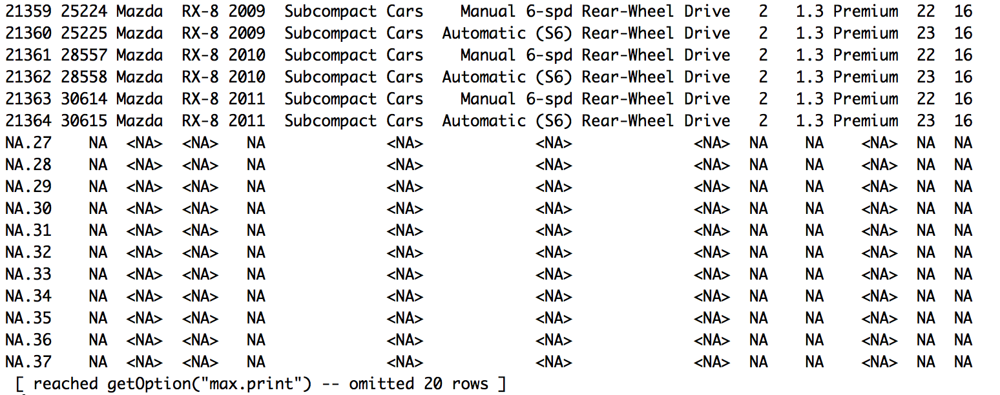
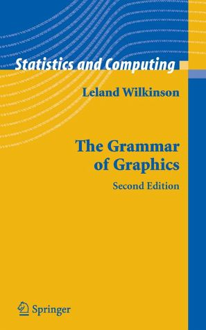
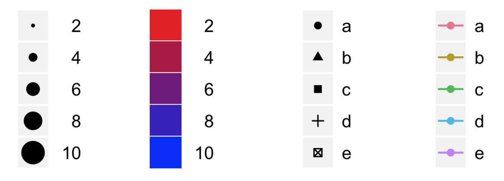

```{r setup, include=FALSE}
knitr::opts_chunk$set(echo=FALSE, message=FALSE, warning=FALSE,
                      fig.width=6, fig.height=4)
library(knitr)
```

# Final project

**Goal: Demonstrate that you know how to do data analysis in R**

Minimum requirements:

- 1 R Markdown file and 1 HTML file
- Use a dataset that we have not used in class
- "Introduction", "Data analysis" and "Conclusion" sections
- At least 3 data visualizations (not all of the same type)
- Examples on the class website
- Due **Nov 2 (Fri), 23:59:59**

# Project proposal

- 1-2 paragraphs long
- Details on the problem you wish to explore, datasets you will use, potential visualizations
- Due **Oct 19 (Fri), 23:59:59**

# Recap of week 1
- Basics of R
- Data structures
    - Homoegeneous: vectors & matrices
    - Hetergeneous: list & data frames
- Functions & packages

# Vectors
```{r echo=TRUE}
vec <- c("a", "b", "c")
vec
vec[c(2,4)]
```

# Lists
```{r echo=TRUE}
classes <- list(quarter = "Fall 2018/19",
             ID = c("STATS 32", "STATS 101", "STATS 200"),
             credits = 12)
classes$ID
classes[["credits"]]
```

# Data frames

A special type of list:

- list keys are variable names of the dataset
- list values are all vectors of the same length (no. of observations)

```{r echo=TRUE}
data(mtcars)
str(mtcars)
```

# Getting a feel for your data

- `str`, `summary`
- `head`, `tail`
- `names`, `dim`, `nrow`, `ncol`
- `table`
- `mean`, `median`, `sd`, `var`
- `factor`

# Weird thing that happened last time...

I want all the rows such that the value of the `cyl` column is equal to 2:

```{r echo=TRUE, eval=FALSE}
vehicles[vehicles$cyl == 2, ]
```

<center>{width=90%}</center>

# Small example
```{r}
df = data.frame(A = c(1, 2, 3, NA, NA), B = c("a", "b", "c", "d", NA))
```

```{r echo=TRUE}
df
df$A == 2
df[df$A == 2, ]
```

# Small example: Fix

Fix 1: test that the value is not NA and is equal to 2
```{r echo=TRUE}
df[!is.na(df$A) & df$A == 2, ]
```

Fix 2: use the `which` function
```{r echo=TRUE}
which(df$A == 2)
df[which(df$A == 2), ]
```

# Function syntax

- Function name
- Parentheses, and 
- A list of arguments within the parentheses
    - Options that change what the function does slightly

E.g. Take the mean of `c(1,3,NA)`.

<div class="column-left-equal">
```{r echo=TRUE}
mean(c(1,3,NA))
```
<center>{width=80%}</center>
</div>

<div class="column-right-equal">

```{r echo=TRUE}
mean(c(1,3,NA), na.rm = TRUE)
```

<center>{width=80%}</center>
</div>

# Agenda for today
- Different kinds of plots
- Plotting with `ggplot2` (and the `+` syntax)

# Words vs. pictures
*"The simple graph has brought more information to the data analyst's mind than any other device."* - John Tukey

```{r warning=FALSE}
library(dplyr)
library(ggplot2)
library(tidyr)
df <- mtcars %>% select(mpg, weight = wt, cylinders = cyl) %>%
    mutate(cylinders = factor(cylinders))
```

<div class="column-left-equal">
<center>
```{r}
df
```

</center></div>

<div class="column-right-equal">
```{r fig.width=5, fig.height=4}
p_base <- ggplot(data = df, mapping = aes(y = mpg, x = weight))
p_scatter <- p_base + geom_point(aes(col = cylinders), size = 2)
p_scatter
```
</div>

# Two classes of variables in statistics

- **Continuous variable**: Variable takes on values which fall on the real number line (or part of it)
    - E.g. height, exam score, attendance count
- **Categorical variable**: Variable takes on values which fall into discrete categories
    - E.g. ice-cream flavor, country of origin


# Barplots: counts for a categorical variable

*What is the distribution of cylinders in my dataset?*

```{r}
ggplot(data = mtcars) +
    geom_bar(aes(x = factor(cyl))) +
    ggtitle("Count by cylinders") +
    xlab("No. of cylinders")
```

# Histograms: counts for a continuous variable

*What is the distribution of `miles per gallon` in my dataset?*

<div class="column-left-equal">
```{r fig.width=5, fig.height=4}
p_hist <- ggplot(data = mtcars) + 
    geom_histogram(aes(x = mpg), breaks = seq(10, 35, 5)) +
    ggtitle("Histogram of miles per gallon")
p_hist
```
</div>
<div class="column-right-equal">
```{r fig.width=5, fig.height=4}
ggplot(data = mtcars) + 
    geom_histogram(aes(x = mpg)) +
    ggtitle("Histogram of miles per gallon")
```
</div>

# Scatterplots: continuous variable vs. continuous variable

*What is the relationship between `mpg` and `weight`?*

```{r}
ggplot(data = df) + 
    geom_point(mapping = aes(y = mpg, x = weight), size = 2) + 
    ggtitle("Miles per gallon vs. weight")
```

# Lineplots: continuous variable vs. time variable

*What is the relationship between `mpg` and time?*

<div class="column-left-equal">
**Not so good...**
```{r fig.width=5, fig.height=4}
library(fueleconomy)
data(vehicles)
vehicles <- vehicles %>% group_by(year) %>% summarize(`mean highway mpg` = mean(hwy))
ggplot(data = vehicles) +
    geom_point(mapping = aes(y = `mean highway mpg`, x = year)) +
    ggtitle("Mean highway mpg by year")
```

</div>

<div class="column-right-equal">
**Easier to see the trend**
```{r fig.width=5, fig.height=4}
ggplot(data = vehicles) +
    geom_line(mapping = aes(y = `mean highway mpg`, x = year)) +
    ggtitle("Mean highway mpg by year")
```
</div>

# Boxplots & violin plots: continuous variable vs. categorical variable

*For each value of cylinder, what is the distribution of `mpg` like?*

<div class="column-left-equal">
```{r fig.width=5, fig.height=4}
ggplot(data = df) + 
    geom_boxplot(aes(cylinders,mpg)) +
    ggtitle("Distribution of mpg by cylinders")
```
</div>
<div class="column-right-equal">
```{r fig.width=5, fig.height=4}
ggplot(data = df) + 
    geom_violin(aes(cylinders,mpg)) +
    ggtitle("Distribution of mpg by cylinders")
```
</div>

# We can combine multiple plots in one graphic
```{r}
set.seed(1111)
ggplot(data = df, aes(cylinders,mpg)) + 
    geom_violin() +
    geom_jitter(height = 0, width = 0.3) +
    ggtitle("Distribution of mpg by cylinders")
```

# We can combine multiple plots in one graphic
```{r}
ggplot(data = vehicles, mapping = aes(y = `mean highway mpg`, x = year)) +
    geom_line() +
    geom_point() +
    ggtitle("Mean highway mpg by year")
```

# Summary

- 1 categorical variable: barplot
- 1 continuous variable: histogram
- Continuous vs. continuous: scatterplot
- Continuous vs. time: lineplot
- Continuous vs. categorical: boxplots & violin plots

## Case study

I have father-son pairs. For each pair, I record their height and weight, as well as their ethnicities. I want to study the relationship between characteristics of the father and that of the son. What plots could help me?

# Data visualization in R: 2 broad approaches
<div class="column-left-equal"><center>
### base R

```{r fig.width=5, fig.height=4}
with(df, plot(x = weight, y = mpg, col = cylinders))
```
</center></div>

<div class="column-right-equal"><center>
### `ggplot2`

```{r fig.width=5, fig.height=4}
p_scatter
```
</center></div>

# How can we describe a graphic?

<div class="column-left">
- *The Grammar of Graphics*, by Leland Wilkinson (1999)
- Motivating example: language
    - **Grammar**: "a formal system of rules for generating lawful statements in a language"
- **Can we develop similar rules for generating plots? Yes!**
- Refined by Hadley Wickham's "[A Layered Grammar of Graphics](http://vita.had.co.nz/papers/layered-grammar.pdf)" (2010)
    - operationalized as `ggplot2` package
    - "official" [cheat sheet](https://www.rstudio.com/resources/cheatsheets/) available
    - [`ggplot2` reference manual](http://ggplot2.tidyverse.org/reference/)
</div>

<div class="column-right"><center>
{width=50%}

{width=50%}
<div class="caption">Hadley Wickham</div>

</center></div>

# 3 essential elements of graphics: data, geometries, aesthetics

<div class="column-left-equal">
**Data**: Dataset we are using for the plot

```{r}
head(df, n = 10)
```
</div>

<div class="column-right-equal">
```{r fig.width=5, fig.height=4}
p_scatter
```
</div>

# 3 essential elements of graphics: data, geometries, aesthetics

<div class="column-left-equal">
**Geom**etries: Visual elements used for our data

- E.g. point, line, histogram, bar, boxplot

Geom: point

</div>

<div class="column-right-equal">
```{r fig.width=5, fig.height=4}
p_scatter
```
</div>

# 3 essential elements of graphics: data, geometries, aesthetics

<div class="column-left-equal">
**Aes**thetics: Defines the data columns which affect various aspects of the geom

- E.g. x, y, color, fill, size, alpha, line type, line width
- Which **aes**thetics you use depend on the **geom**etries you choose

3 different aesthetics:

- x-axis: weight
- y-axis: mpg
- color: cylinders
- shape, size, etc. take on default values, not determined by data

</div>

<div class="column-right-equal">
```{r fig.width=5, fig.height=4}
p_scatter
```
</div>

# Examples of other aesthetics
<div class="column-left-equal">
- x-axis: weight
- y-axis: mpg
- size: cylinders
- alpha: weight
</div>

<div class="column-right-equal">
```{r fig.width=5, fig.height=4, warning=FALSE}
p_base + geom_point(aes(size = cylinders, alpha = weight))
```
</div>

# Examples of other aesthetics
<div class="column-left-equal">
- x-axis: weight
- y-axis: mpg
- color: cylinders
- shape: cylinders

</div>

<div class="column-right-equal">
```{r fig.width=5, fig.height=4, warning=FALSE}
p_base + geom_point(aes(col = cylinders, shape=cylinders), size = 3)
```
</div>

# Combining multiple plots into one graphic: Layers

We can have more than one **layer** in a graphic.

 **=**  **+** 

Each layer contains (essentially):  

- 1 dataset, 1 **geom**etric object, **aes**thetic mappings

# `ggplot2` code: take 1
Making use of `ggplot`'s sensible defaults:
```{r echo=TRUE}
ggplot() +
    geom_boxplot(data = df, mapping = aes(x = cylinders, y = mpg)) +
    geom_point(data = df, mapping = aes(x = cylinders, y = mpg))
```

# `ggplot2` code: take 2
Using jitter to avoid "overplotting":
```{r echo=TRUE}
ggplot() +
    geom_boxplot(data = df, mapping = aes(x = cylinders, y = mpg)) +
    geom_point(data = df, mapping = aes(x = cylinders, y = mpg), 
               position = "jitter")
```


# `ggplot2` code: take 3
When layers share attributes, we only have to type them once:
```{r echo=TRUE}
ggplot(data = df, mapping = aes(x = cylinders, y = mpg)) +
    geom_boxplot() +
    geom_point(position = "jitter")
```

# Today's dataset: Diamonds  

<center>**What makes an expensive diamond?**</center>

<center>{width=80%}
<div class="caption">(Source: [USA TODAY](https://www.usatoday.com/videos/tech/science/2018/07/16/-quadrillion-tons-diamonds-hiding-below-earths-surface/36912769/))</div>
</center>


----
<br><br><br><br><br><br><br><br>
<font size = 36><b>Optional material</b></font>

# Full specification of a graphic

One graphic contains:

- 1 or more layers
    - Each layer has 1 dataset, 1 **geom**etric object, **aes**thetic mappings, 1 statistic (default usually ok), 1 position (default usually ok)
- 1 scale for each aesthetic mapping (defaults usually ok)
- 1 coordinate system (default usually ok)
- facet specification (if any)  

# Other grammatical elements: statistics

Behind the scenes, R may need to do some transformation on the dataset to make the graphic.

- **Each geometry has a default statistic, usually good enough**

```{r}
p_hist
```

    
# Other grammatical elements: position
Sometimes we need to tweak the position of the geometric elements because they obscure each other.

- E.g. jitter: randomly shifting points slightly

<div class="column-left-equal">
**Only 9 data points??**
```{r fig.width=5, fig.height=4, warning=FALSE}
ggplot(data = mtcars, mapping = aes(x = cyl, y = carb)) + 
    geom_point(size = 2) +
    ggtitle("No. of carburetors vs. no. of cylinders")
```
</div>

<div class="column-right-equal">
**Much better**
```{r fig.width=5, fig.height=4, warning=FALSE}
ggplot(data = mtcars, mapping = aes(x = cyl, y = carb)) + 
    geom_point(size = 2, position = "jitter") +
    ggtitle("No. of carburetors vs. no. of cylinders")
```
</div>

# Other grammatical elements: facets

- Plotting different parts of our data on different canvases
- We can facet by rows and/or columns

```{r}
p_scatter + facet_wrap(~cylinders)
```

# Other grammatical elements: scales

- Aesthetics only tell you which column corresponds with which aesthetic (e.g. cylinder -> color)
- Does not tell you which color should represent which cylinder value
- **Scales** define that for you

<center>{width=70%}
<div class="caption">Examples of scales 
(Source: [A Layered Grammar of Graphics](http://vita.had.co.nz/papers/layered-grammar.pdf))</div>
</center>

# Scales example: colors

<div class="column-left-equal">
**Default colors**
```{r fig.width=5, fig.height=4, warning=FALSE}
p_scatter
```
</div>

<div class="column-right-equal">
**Manually chosen colors**
```{r fig.width=5, fig.height=4, warning=FALSE}
p_scatter + scale_color_manual(values=c("gold2", "darkorange","firebrick"))
```
</div>

# Scales example: x- & y-axes

<div class="column-left-equal">
**Default axis limits**
```{r fig.width=5, fig.height=4, warning=FALSE}
p_scatter
```
</div>

<div class="column-right-equal">
**Manually chosen axis limits**
```{r fig.width=5, fig.height=4, warning=FALSE}
p_scatter + scale_x_continuous(limits = c(0, 6)) +
    scale_y_continuous(limits = c(0, 35))
```
</div>


# Other grammatical elements: themes

Refers to all non-data ink

- Titles, axis ticks & labels, background color, legend, etc.
- Can manually set each item, or use preset themes

<div class="column-left-equal">
**`ggplot2`'s default theme**
```{r fig.width=5, fig.height=4}
p_scatter
```
</div>

<div class="column-right-equal">
**Minimal theme**
```{r fig.width=5, fig.height=4}
p_scatter + theme_minimal()
```
</div>

# More pre-set themes

<div class="column-left-equal">
**Classic theme**
```{r fig.width=5, fig.height=4}
p_scatter + theme_classic()
```
</div>

<div class="column-right-equal">
**Dark theme**
```{r fig.width=5, fig.height=4}
p_scatter + theme_dark()
```
</div>

# Shapes in R

<center>
{width=50%}
</center>

# Colors in R

<div class="column-left-equal">
- **By name:** e.g. "blue", "red", "black", "white" (full list [here](http://www.stat.columbia.edu/~tzheng/files/Rcolor.pdf))
- **By RGB value:** e.g. `rgb(0,0,1)`, `rgb(1,0,0)`, `rgb(0,0,0)`, `rgb(1,1,1)`
- **By hexadecimal value:** e.g "#0000FF", "#FF0000", "#000000", "#FFFFFF"
</div>
<div class="column-right-equal"><center>
{width=70%}
</center></div>

# Color scales in R

<center>
{width=90%}</center>