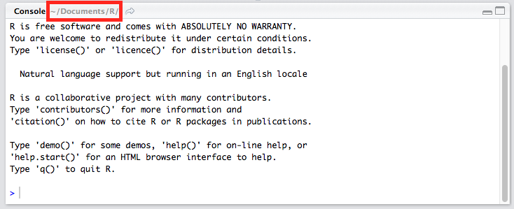
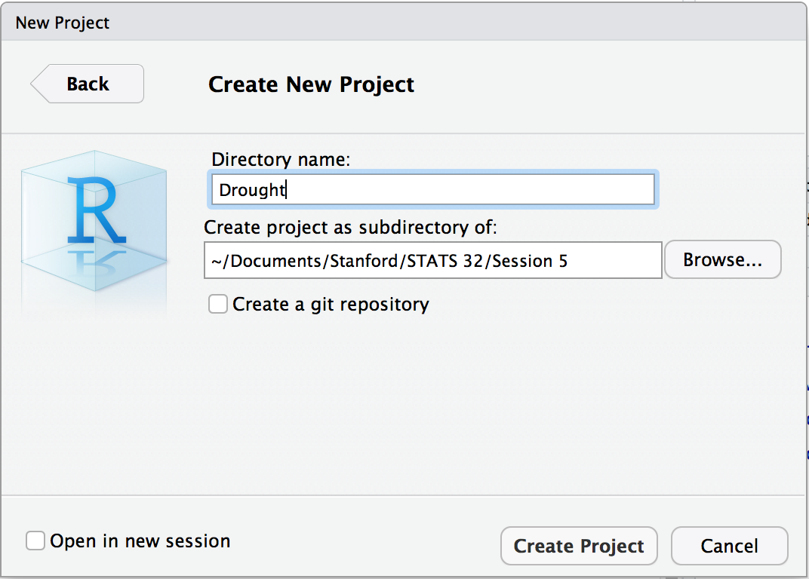
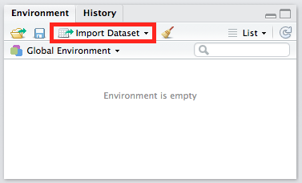
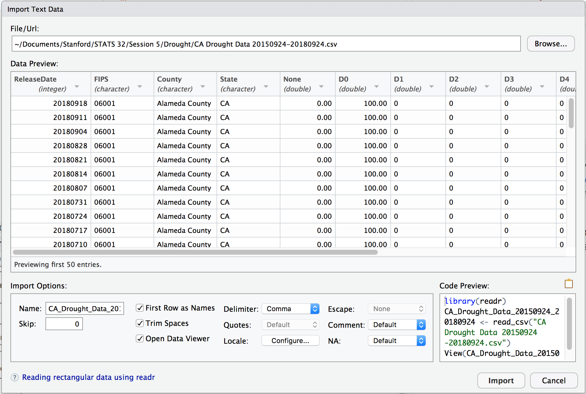

```{r setup, include=FALSE}
knitr::opts_chunk$set(echo = TRUE)
```

## Working directories

Before we starting analyzing the drought data, let's first talk about the notion of **working directories**.

The working directory is where R looks for files that you ask it to load, and where it will put any files that you ask it to save. You can see your current working directory at the top of the console (yours may be different from mine):  

<center></center>
\

You can also see it through the `getwd()` function.

As you get more experienced and start handling more projects, it's a good idea to organize your projects into directories and, when working on a project, set the working directory to the project's directory. That way, you will know where to find your project files and you won't mix files from different projects together.

You can change the working directory using the `setwd()` function. However, you won't have to do this if you follow the instructions in the next section.

## Creating an R project
Click on `File > New Project...`, then "New Directory" and "New Project". (If a pop-up appears asking you if you want to save your current workspace (a `.RData` file), click "Don't Save".) You should end up at a window something like the one below. Key in "Drought" for "Directory name". As for "Create project as subdirectory of", select a folder that makes sense. I keep all my files related to this class in a "STATS32" folder, so it makes sense to create the "Drought" project folder here.

<center>{width=50%}</center>
\

Click on "Create Project". If you check the current working directory now, you'll see that it's the directory you just created. Try exiting RStudio and opening it up again. You'll see that you are back where you left off: in the Drought project folder.

To exit a project, click on `File > Close Project`. To open a project, click on `File > Open Project...`, and select the .Rproj file.

Download the drought dataset and place it in the Drought project folder. Now look at the "Files" pane in the bottom-right hand corner: the data set appeared! (Another way to see the list of files in the current working directory is `list.files()`.)

<center>{width=30%}</center>
\  

## R Scripts

Click on the  button and select "R Script". Save the R script as "Drought analysis" in the Drought project folder. Note that the file as a `.R` extension: this is the file extension for R scripts.

**Why write R scripts?** R scripts facilitate easy storage, running and sharing of code. For example:  

- If we wanted to get the results of our drought analysis for a different county or state, we already have all the R commands saved in an .R file: all we have to do is make some minor changes to select the correct county and re-run all the commands.
- If we wanted to run this script every week to get a plot based on the latest information, we just need to run the script.
- If a friend wanted to learn how to run our analysis, we just have to hand him/her the R script instead of walking them through each step.

**How to write R scripts?** Just type commands in the window for the file, with each command on its own line.

It can be difficult to write an R script all at once. Instead, we can use the following workflow to make sure that script works as it should:  

1. Type a line of code in the window for the file.  
2. Highlight the line of code, then execute it by selecting the  button > `Run Selected Line(s)` (or using the `Cmd-Enter` or `Ctrl-Enter` shortcut). This action copies the code to the console and runs it.
3. Check that the result that you get is what you want. If it is not, amend the code and perform step 2 again.  
4. Once you are done, save the R script and exit RStudio. Open RStudio and the R script, highlight all the code and run it. If you didn't make any mistakes with your code, it should run as you intended.  

For all the code below, follow the workflow above, i.e. type it into the window for the R script, then run it in the console.

## Loading the drought dataset

Download and install the `readr` and `tidyr` packages using `install.packages("readr")` and `install.packages("tidyr")`. To load our drought dataset, click on the "Import Dataset" button in the "Environment" pane, then click "From Text (readr)..."

<center></center>
\

For "File/Url", click the "Browse" button on the right and locate the drought dataset. Within a short period of time, the "Data Preview", "Import Options" and "Code Preview" sections are populated:

<center></center>
\

First, look at the "Code Preview" section. This is the code that R is using in order to produce the dataset seen in the "Data Preview". It loads the `readr` package, then uses the `read_csv()` function to read in the data file.

Next, look at the "Data Preview" section. Notice how each column has a type associated with it. How does `read_csv()` know what type each column is? From the documentation, `read_csv()` looks at the first 1000 rows in the dataset and makes a guess. It's often correct, but sometimes it's not. For example, it gets the date columns in our dataset wrong.

To change the type, click on the little down arrow next to the column name and select "Date". When prompted to "enter the format string", enter `%Y%m%d` for the `ReleaseDate` column and `%Y-%m-%d` for the `ValidStart` and `ValidEnd` column. Notice how both the "Data Preview" and "Code Preview" sections change.

Now, let's go back to the "Code Preview" section. Notice how you can actually amend the code! Instead, of using the long default variable name, assign the output of `read_csv(...)` to `df`.

Finally, highlight the code (except for the last line) and copy it (either by `Ctrl-C` or `Cmd-C`, or `Right click > Copy`). Click the "Cancel" button, then paste the code into the "Drought analysis.R" file (**note:** your filepath in `read_csv(...)` may be different from mine since your data file might be stored in a different location):
```{r}
library(readr)
df <- read_csv("CA Drought Data 20150924-20180924.csv", 
               col_types = cols(ReleaseDate = col_date(format = "%Y%m%d"), 
                                ValidEnd = col_date(format = "%Y-%m-%d"), 
                                ValidStart = col_date(format = "%Y-%m-%d")))
```

Consider what the code above does when someone else opens it on their computer. R looks for the file `CA Drought Data 20150924-20180924.csv` in the present working directory. Hence, anyone using this script must make sure this file is in the present working directory; if not an error will occur when the script is run.

When writing scripts, it is good practice to leave comments in your scripts. Comments are lines within your code that are not executed; rather, they are there to tell the programmer what the code is doing. This is a good practice: it is very easy to forget what a block of code is doing after you haven't seen it for some time.

In an R script, we start a comment with a `#` sign, followed by whatever we want to say. R interprets anything on a line after the # sign as comments and will not execute it as code. We can comment our code above as follows:
```{r eval=FALSE}
# read in drought dataset
library(readr)
df <- read_csv("CA Drought Data 20150924-20180924.csv", 
               col_types = cols(ReleaseDate = col_date(format = "%Y%m%d"), 
                                ValidEnd = col_date(format = "%Y-%m-%d"), 
                                ValidStart = col_date(format = "%Y-%m-%d")))
```

## Examining the dataset

Let's view the dataset by typing in its name:
```{r}
df
```

Before we start using the dataset for our analysis, we should do some sanity checks to make sure that the data we have is indeed the data we expect. For example: California has 58 counties, so we should have all 58 counties represented. We check this using `summarize` and the function `n_distinct`.
```{r message=FALSE}
# Sanity check: should have all 58 counties
library(dplyr)
df %>% summarize(distinct = n_distinct(County))
```

Let's do another sanity check: Since we have 3 years of data, we should expect around $52 \times 3 = 156$ entries for each county. We check this by counting the number of entries, then checking that `156` is the only value we receive among all the counts:
```{r}
# Sanity check: each county should have ~156 observations
df %>% group_by(County) %>%
    summarize(count = n()) %>%
    distinct(count)
```

It's not 156, but it's close enough. It's also a good sign that all the counties have the same number of observaations.  

Some thoughts about the fields in our dataset:  

- `ReleaseDate` seems to be the same as `ValidStart`, and `ValidEnd` is always 6 days later than `ValidStart`. We can keep only the `ValidStart` column and treat that as the date which the data in that row is referring to.
- We are not going to use `FIPS` and `StatisticFormatID` (we don't know what they mean anyway), and `State` is the same for all values in our dataset, so we can safely drop these columns.
- The columns from `None` to `D4` always add up to 100%. Since we are not going to plot the `None` column, we can drop it.

Let's keep just the rows we want using `select` in `dplyr`. Type in the code below (notice how the code below changes the name for column `ValidStart` at the same time):
```{r}
# select important rows
df_levels <- df %>% select(County, Date = ValidStart, D0:D4)
```

## Some `dplyr` practice

1. Select the rows with D4 being 100.  
```{r}
df_levels %>% filter(D4 == 100)
```

2. Which county experienced the most number of weeks with 100% land area in D4?  
```{r}
df_levels %>% 
    filter(D4 == 100) %>% 
    group_by(County) %>% 
    summarize(count = n()) %>%
    arrange(desc(count))
```

3. Which counties experienced 100% land area in D4 at any time? (Hint: instead of n_distinct, try distinct.)
```{r}
df_levels %>% filter(D4 == 100) %>%
    distinct(County)
```

4. Select rows with date "2018-09-18" and return the entries in descending order of D0.

```{r}
df_levels %>% filter(Date == "2018-09-18") %>% arrange(desc(D0))
```

## Tidying and making our chart

The chart we want to make display data for just Santa Clara county, so we should use `dplyr`'s `filter` to get a new dataset with just the observations from Santa Clara:
```{r}
# filter for just Santa Clara County
df_county <- df_levels %>% filter(County == "Santa Clara County")
```

Let's plot a histogram of `D0`:
```{r}
library(ggplot2)
ggplot(data = df_county) +
    geom_histogram(aes(x = D0))
```

Next, let's make a line plot of `D0` against `Date`:
```{r}
ggplot(data = df_county) +
    geom_line(mapping = aes(x = Date, y = D0))
```

To make an area plot instead, replace `geom_line` with `geom_area`:
```{r}
ggplot(data = df_county) + 
    geom_area(mapping = aes(x = Date, y = D0))
```

How can we plot `D0` and `D1` against `Date`? We could try this:
```{r}
ggplot(data = df_county) + 
    geom_area(mapping = aes(x = Date, y = D0)) +
    geom_area(mapping = aes(x = Date, y = D1))
```

There are a number of issues with this approach:  

- It doesn't scale. To display `D0` to `D4`, we need 3 more lines of code. What if there were 10 drought levels instead?
- Both areas are filled in with black and are stacked on top of each other, so we can't tell the difference between the two.
- The y-axis reads `D0` even though the values plotted are for `D0` and `D1`.

The reason we are facing this issue is because the values of drought level are column names. We need to reorganize the dataset such that there is a `Drought level` column with values `D0` to `D4`, and a corresponding `Percent of land area` which gives the percent of land area in that level of drought (In Hadley Wickham's terminology, the original dataset is not "tidy" and we have to make it so.) We can use `tidyr`'s `gather` function to accomplish this. (See optional material in slides for more details.)
```{r}
# gather drought levels
library(tidyr)
df_county <- df_county %>% gather(D0:D4, key = "Drought level", 
                                  value = "Percent of land area")
```

Now we can easily plot `D0` to `D4` on the same chart (because our column names have spaces in them, we need to surround them with backticks (\`) so that R interprets the code properly):
```{r}
# make area plot
ggplot(data = df_county) + 
    geom_area(mapping = aes(x = Date, y = `Percent of land area`, 
                            fill = `Drought level`))
```

Let's use `scale_fill_brewer` to make the area colors more theme-appropriate, and add a title:
```{r}
# make area plot
ggplot(data = df_county) + 
    geom_area(mapping = aes(x = Date, y = `Percent of land area`, 
                            fill = `Drought level`)) + 
    labs(title = "Drought levels in Santa Clara County") +
    scale_fill_brewer(palette = "YlOrRd") +
    theme(plot.title = element_text(face = "bold", hjust = 0.5))
```

(`scale_fill_brewer` works in the same way as `scale_color_brewer`, except that it refers to the "fill" aesthetic rather than the "color" aesthetic. Both of these functions work for discrete variables; for continuous variables, use `scale_fill_distiller` and `scale_color_distiller` instead.)

## Tidying up the R Script

At this point, your script should look something like `Drought Analysis v1.R`.

Let's reorganize the script to make it more readable.  

1. All `library` commands are usually put right at the top.  
2. Remove code that is not needed for plotting the area plot (e.g. dplyr practice section, histograms and line plots).  
3. It seems to make logical sense to chain the `gather` statement with the `select` statement, since those are all operations that give us a final dataset that is plotting-friendly. After rearrangement, the script should look like `Drought Analysis v2.R`.  
4. Following programming best practice, we should add a few lines of comments at the top of the script explaining what the script does.  

To check that the script does what it's supposed to do, quit RStudio, then reopen RStudio. Load the script and run all the lines of code in it. The same chart should appear.  

## Plots for different counties

The plot we just made was for Santa Clara County. What if we were interested in another county, say Monterey County, instead? Do we have to type up all the code again? **No**: we could just look for all mentions of "Santa Clara County" and change them to "Monterey County".

While this works, it is not advised: if "Santa Clara County" was used 50 times in our script, we'd have to find all 50 instances and change them. A better way to do this would be to assign the county to a variable right at the top of the script, and have all mentions of the county in the script be replaced by this variable.

To do this, insert the following lines at the top of `Drought analysis v2.R` (but don't run them):
```{r eval=FALSE}
# PARAMETERS (to change if necessary)
county <- "Santa Clara County"
```

Next, replace the line of code for filtering (lines 29-33 of `Drought analysis v2.R`) with the following code (but don't run it):
```{r eval=FALSE}
# filter for just the county we want
df_county <- df_levels %>% 
    filter(County == county) %>%
    gather(D0:D4, key = "Drought level", 
           value = "Percent of land area")
```

The other place that "Santa Clara County" appears is in the title of the plot (line 39 of `Drought analysis v2.R`). Change it to the following code (see `?paste` to understand what the code is doing):
```{r eval=FALSE}
    labs(title = paste("Drought levels in", county)) +
```

Now, if we want to get the plot for Monterey County, all we have to do is change the string that is assigned to `county` and re-run the whole script.  

## Session info  
```{r}
sessionInfo()
```

