# Recap of week 2  

- Visualizing data with `ggplot2`
    - Different types of plots
    - Key elements: data, **geom**etries, **aes**thetics
- Transforming data with `dplyr`
    - `select`
    - `mutate`
    - `arrange`
    - `filter`
    - `summarize`
    - `group_by`
    
# Agenda for today
- Review of syntax in R  
- Creating projects in R  
- Importing data with `readr`  

"Official" cheat sheet for `readr` available [here](https://www.rstudio.com/resources/cheatsheets/).

# Function syntax

The most important syntax in R is the **function call**. All R syntax has function calls underlying it.

```{r eval=FALSE}
function_name(<inputs to the function>,
              <arguments which change 
              how the function operates>)
```

```{r}
x <- c(-5, -3, -1, 1, 3, NA)
mean(x, na.rm = TRUE)
```

<center>
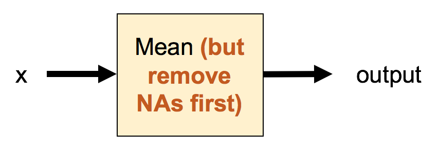{width=60%}</center>

# Function calls read "inside out"

`abs(x)`: If `x` is positive, return `x`. If `x` is negative, return `x` without the negative sign.

```{r}
mean(abs(x), na.rm = TRUE)
```

<center>
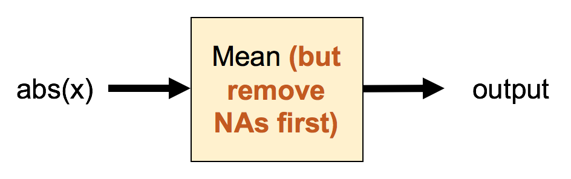{width=60%}</center>

# Function calls read "inside out"

`abs(x)`: If `x` is positive, return `x`. If `x` is negative, return `x` without the negative sign.

```{r}
mean(abs(x), na.rm = TRUE)
```

<center>
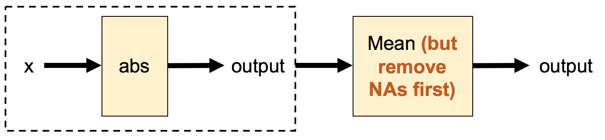{width=80%}</center>

# `%>%` syntax with `dplyr`

Take the `mtcars` dataset, select just the `wt` and `mpg` columns, <i>then select rows with mpg < 15</i>

```{r eval=FALSE}
mtcars %>% 
    select(wt, mpg) %>% 
    filter(mpg < 15)
```

<center>
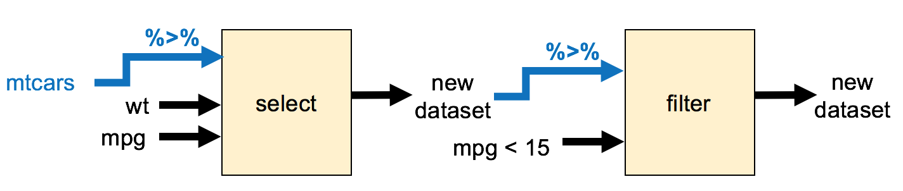{width=90%}</center>

# `+` syntax with `ggplot2`

```{r fig.width=5, fig.height=4}
library(ggplot2)
ggplot(data = mtcars, mapping = aes(x = wt, y = hp)) +
    geom_point() +
    labs(title = "Horsepower vs. Weight", x = "Weight", 
         y = "Horsepower") +
    theme_classic()
```

# Scripts in R

- So far, we have not saved anything
- If you don't save workspace, upon reopening R:
    - All variables you created will be gone
    - If you want to use packages (e.g. `dplyr`), you have to reload them
- **This is a good thing!**
    - Forces you to save all important code in **scripts**
    - Allows you to reproduce your results further down the road

<center>{width=50%}</center>

# Working directories in R

- Directory where R looks for files that you ask it to load
- Also where R will put any files that you ask it to save
- You can see your current working directory at the top of the console or by typing `getwd()`

<center>{width=60%}</center>

# Projects in R

- With more projects, it's a good idea to organize your projects by directory
- You will know where to find your project files
- You won't mix files from different projects together

# Today's dataset: Drought in California  
<center>{width=80%}</center>

# Data source: United States Drought Monitor (USDM)  

<center>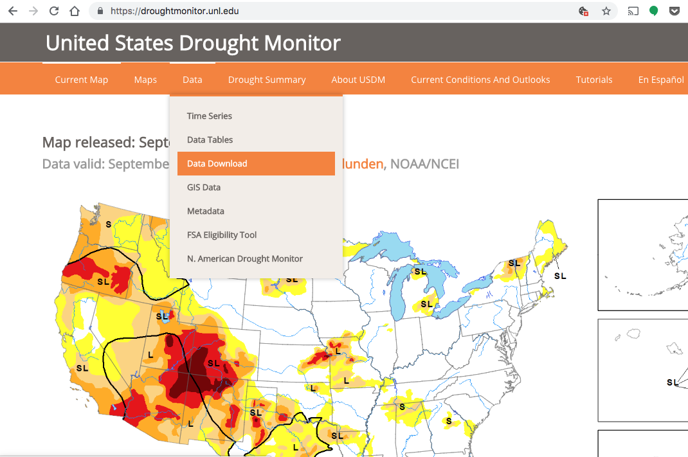{width=70%}
<div class="caption">(Source: [droughtmonitor.unl.edu](https://droughtmonitor.unl.edu/))</div></center></div>

# USDM: data download    

<center>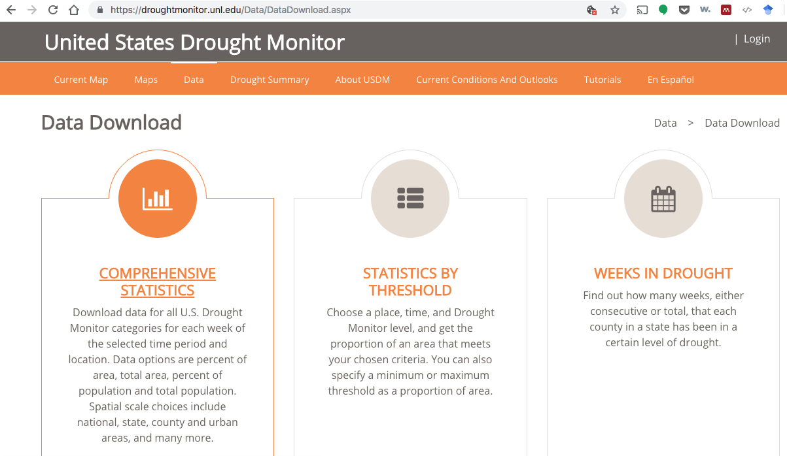{width=80%}</center>

# USDM: data selection  

<center>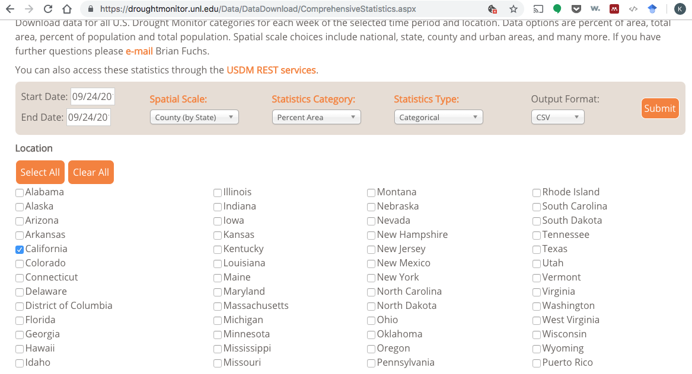{width=90%}</center>

# The data in Excel
<center>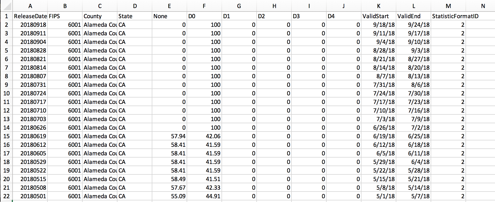{width=98%}</center>

- `None` to `D4`: drought levels of increasing severity
- Numbers: % by land area at that drought severity level  

----
<br><br><br><br><br><br><br><br>
<font size = 36><b>Optional material</b></font>

# Different packages for working with different data formats  

- **.txt, .csv files (`readr`)**
- .xls, .xlsx files (`readxl`)
- SPSS, Stata & SAS files (`haven`)
- Databases (`DBI`)
- JSON files (`jsonlite`)
- XML files (`xml2`)
- Web APIs (`httr`)
- HTML web scraping (`rvest`)  

# USDM: data selection details  

- Spatial Scale: County (by State), then just select California  
- Statistics Category: Percent Area  
- Statistics Type: Categorical  
- Output Format: CSV  

# `tidyr` functions: `gather` and `spread`

<div class="column-left-equal">
`gather`: Used when some column names are not variables, but values of a variable

<center>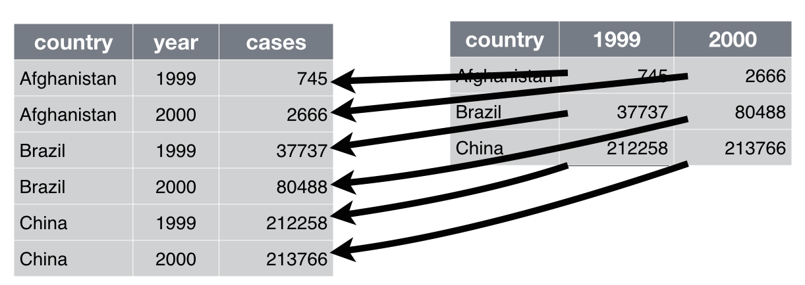{width=100%}
<div class="caption">(Source: [R for Data Science](http://r4ds.had.co.nz/tidy-data.html))</div></center>
</div>

<div class="column-left-equal">
`spread`: Opposite of `gather`

<center>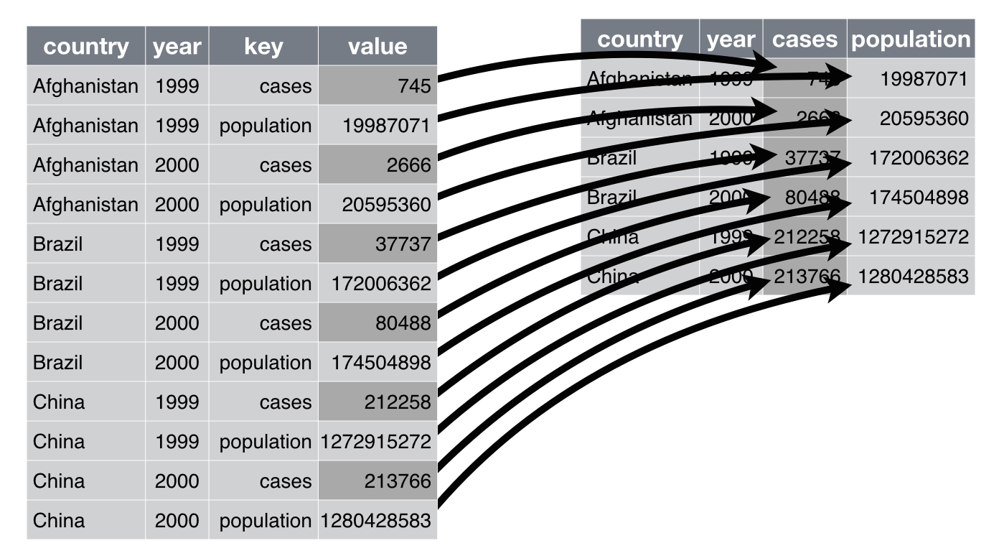{width=100%}
<div class="caption">(Source: [R for Data Science](http://r4ds.had.co.nz/tidy-data.html))</div></center>
</div>

# `tidyr` functions: `separate` and `unite`

<div class="column-left-equal">
`separate`: Used to separate values in one column into multiple columns

<center>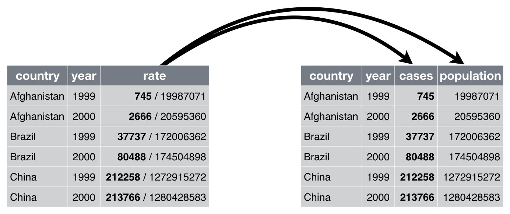{width=100%}
<div class="caption">(Source: [R for Data Science](http://r4ds.had.co.nz/tidy-data.html))</div></center>
</div>

<div class="column-left-equal">
`unite`: Opposite of `separate`

<center>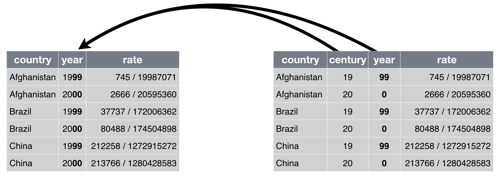{width=100%}
<div class="caption">(Source: [R for Data Science](http://r4ds.had.co.nz/tidy-data.html))</div></center>
</div>

