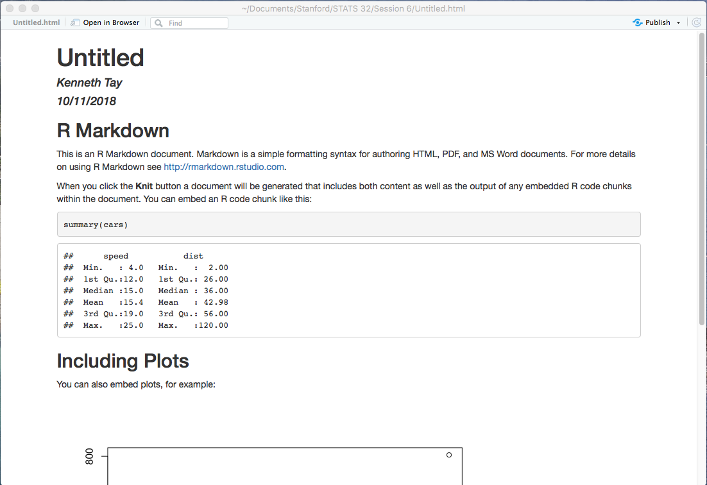

```{r setup, include=FALSE}
knitr::opts_chunk$set(echo = TRUE, eval = FALSE)
```

Follow the instructions in this document to check that the R markdown system is working fine on your machine.  

## Creating an R markdown file

Click on the  icon in the top-left corner of the window and select "R Markdown..." In the window that pops up, click "OK". Upon clicking "OK", a new sub-window appears in the top-left of our RStudio window with some default text.

<center>{width=60%}</center>
\

Click on the  button (or use the shortcut `Cmd/Ctrl + Shift + K`) to knit the document. You will be prompted to save the file (if not already saved). Just save it as "Untitled.Rmd" for now.

After some time, a preview of the document should open up in a new window, looking like this:

<center>{width=50%}</center>
\

(It's possible that your preview shows up in the "Viewer" window in the bottom-left corner as well. To expand it to a new window, click the "Show in new window" button (on the right of the broom icon).)

If you followed along and everything went fine, great! You are ready to go. If you ran into any issues along the way, please send me the error message, along with a description of what happened, your R & RStudio versions, and your operating system. That will help me to figure out what might have gone wrong.