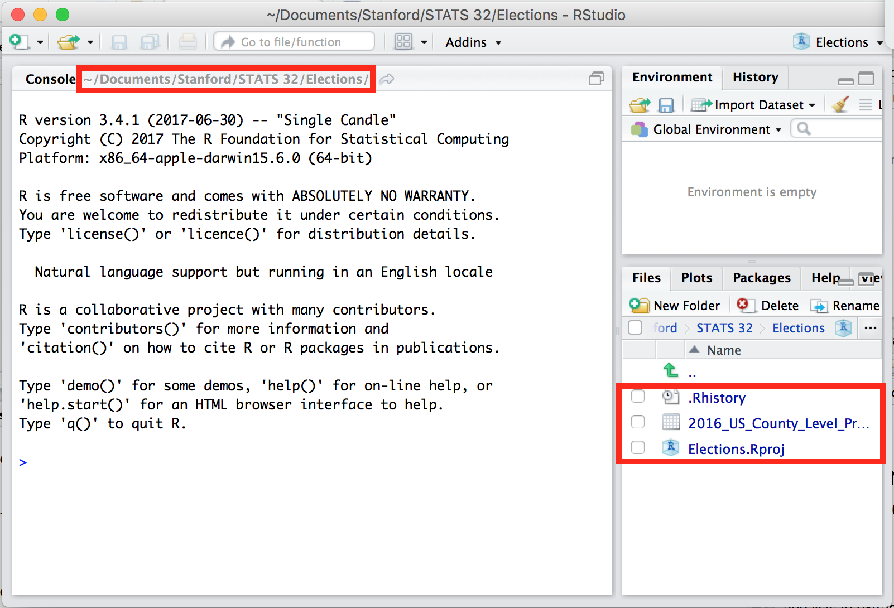
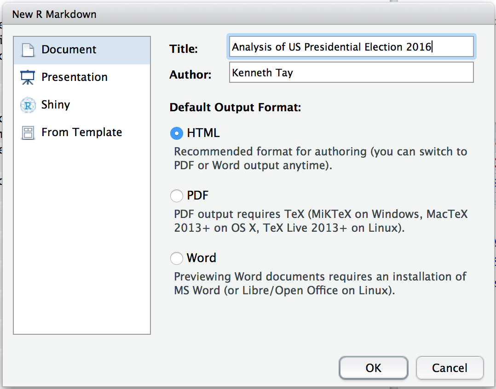
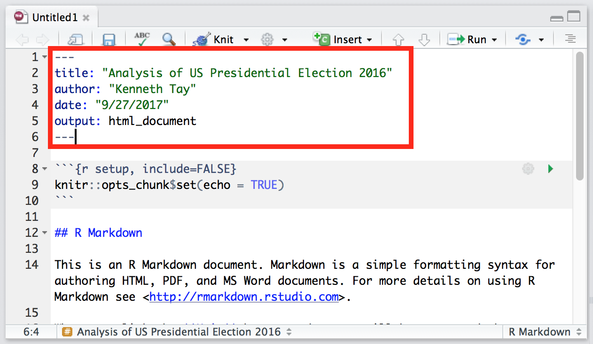
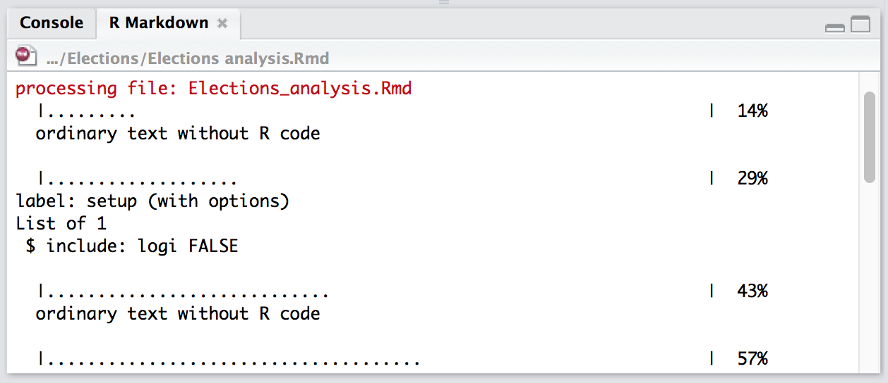
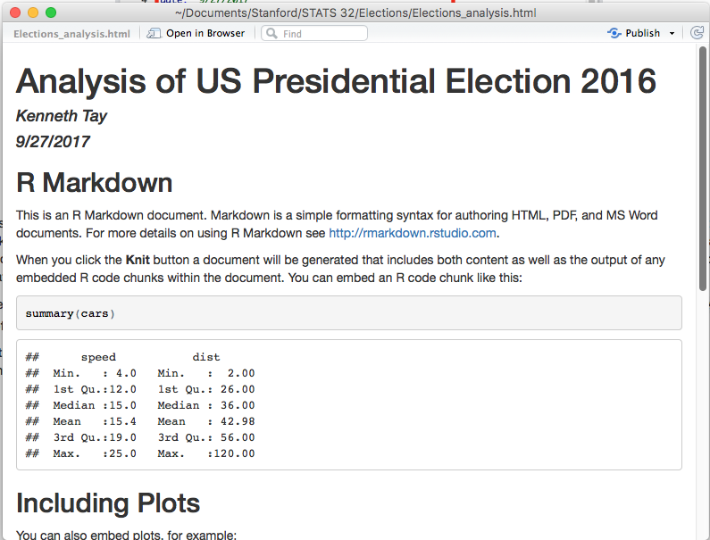

```{r setup, include=FALSE}
knitr::opts_chunk$set(echo = TRUE, eval = FALSE)
```

## Creating an R markdown file

Create a new project named "Elections". (For instructions on how to create a new project, see Session 5's code file.) Move the dataset `2016_US_County_Level_Presidential_Results.csv` (which you can download from Canvas) into the newly created "Elections" folder. Your RStudio window should look something like this:

<center>{width=60%}</center>
\

Let's create an R markdown file where we will write up our data analysis. Click on the  icon in the top-left corner of the window and select "R Markdown..." In the window that pops up, select "Document" in the sidebar on the left. Type in "Analysis of US Presidential Election 2016" for `Title`, and your name for `Author`. For "Default Output Format", select HTML. Click "OK".

<center>{width=60%}</center>
\

Upon clicking "OK", a new sub-window appears in the top-left of our RStudio window with some default text. Notice how the filename is "Untitled1"? Save the document in the "Elections" folder with the name "Elections analysis". The filename in the window will become "Elections analysis.Rmd".

<center>{width=60%}</center>
\

The top section (boxed in red) is called the **YAML** header ("yet another markup language"). It is separated from the rest of the document by `---`s. R markdown uses it to control many details of the whole document. We won't talk much about this header in this class. Just notice that the "title" and "author" fields were automatically populated by what we filled in in an earlier window, and that the date is the date when the document was created. You can change these fields by manually editing them here.

To create the HTML document from this R Markdown file, click on the  button (or use the shortcut `Cmd/Ctrl + Shift + K`). A couple of things happen when you do this:  

- If the file has not be saved yet, it will be saved.  
- An "R Markdown" tab appears in the bottom-left sub-window, looking something like this:
<center>{width=50%}</center>
\
- A new file, "Elections_analysis.html", is created in the "Elections" folder.  
- A preview of our document opens in a new window:
<center>{width=50%}</center>
\

(It's possible that your preview shows up in the "Viewer" window in the bottom-left corner as well. To expand it to a new window, click the "Show in new window" button (on the right of the broom icon).)

If you open up the ".html" file in your web browser, you will see that it is the same as the preview.

Compare the contents of the `.Rmd` file with the preview that you see. Can you see how the markdown syntax (such as the `##` before "R Markdown" and the asterisks surrounding "Knit") get styled in the final document?

Next, notice how code chunks are represented in the `.Rmd` file. They start with ```` ```{r} ```` and end with ```` ``` ````. The next word after `r` (e.g. `cars`, `pressure`) is the name of the code chunk. If you scroll through the "R Markdown" tab in the bottom-left window, you'll see these names pop-up. Code chunks don't need to have a name. After the name of the code chunk, you may see things like `echo=FALSE` or `include=FALSE`. We'll talk about these as we go along.

Finally, notice that our environment is empty (see "Environment" tab in the top-left window). When we knit a document, R essentially starts a new session/environment and runs all the code there.

## Elections analysis

To illustrate how to use R markdown for presenting data analyses, we will work through a case study on the 2016 US presidential elections. The data analysis is mean to be illustrative, not comprehensive.

For the rest of this session, you should open the `Elections analysis final.Rmd` file and follow along, even as you type up your own `.Rmd` file.

Delete everything in the `.Rmd` file except the YAML header and the first code chunk.

### Set-up

The code in the chunk labeled "setup" sets global options for all code chunks to follow. By setting `echo=TRUE`, all code chunks that follow will be printed, along with their result. (If we set it to `echo=FALSE`, we will not see the code chunks in the published document. However, the code is still run and the results of the code will be shown.)

### Introduction

It's always a good idea to have an introduction section to your data analysis. Type the following below the setup code chunk:

```{r eval=FALSE}
## Introduction

This is an analysis of US presidential elections data for 2016...
```

### Data import and checking

Next, let's create a code chunk to import the libraries that we will use. It's hard to know exactly which packages we are going to use in advance, but we can always go back to this chunk and amend it later. There are a number of ways to create a code chunk:  

- Manually type ```` ```{r} ````, followed by your code, then closing the chunk with ```` ``` ````,  
- Clicking the  button, followed by "R", or
- Using the `Cmd/Ctrl + Alt + I` shortcut.

```{r}
library(dplyr)
library(ggplot2)
library(readr)
```

Next, create another code chunk to read in data and to show what the data contains with the `head` function:

```{r}
df <- read_csv("2016_US_County_Level_Presidential_Results.csv")
head(df)
```

Knit the document to see what it looks like at this point. See how there is a whole bunch of messages after the `library(dplyr)` line? While informative when doing our data analysis, it's probably something we don't want to present. To remove this message (and all other future messages), go to the `setup` code chunk and amend `knitr::opts_chunk$set(echo = TRUE)` to `knitr::opts_chunk$set(echo = TRUE, message = FALSE, warning = FALSE)`. If we knit the document now, we'll see that the `dplyr` messages are no longer there.  

The `knitr` package provides us with a function, `kable()`, that helps print datasets more nicely in R markdown files. Add `library(knitr)` to the library imports chunk, and change `head(df)` to `kable(head(df))`. Knit the document again to see the difference.

To orient our reader to the dataset, we may want to then say something like, "the dataset contains the following columns", followed by a code chunk with the code `names(df)`, then followed by some explanation of the fields. Do the above and knit the document again.

Here is some detail on the columns in our dataset:

- `per_dem` and `per_gop` refer to the percentage of votes going to Democrats and Republicans respectively.
- `diff` represents the absolute difference between Republican votes - Democrat votes.
- `per_point_diff` represents this difference as a percentage of total votes.
- `combined_fips` is a 5-digit code identifying the county. (From [Wikipedia](https://en.wikipedia.org/wiki/FIPS_county_code): The FIPS county code is a five-digit Federal Information Processing Standards (FIPS) code (FIPS 6-4) which uniquely identifies counties and county equivalents in the United States, certain U.S. possessions, and certain freely associated states.)

Notice that the `diff` and `per_point_diff` columns are always positive. Since we are interested in whether a given county had more Republican or Democrat votes, we have to recompute these columns. The following code does it, with the columns being positive if there are more Republican votes than Democrat votes (and vice versa).

```{r}
df <- df %>% mutate(diff = votes_gop - votes_dem,
                    per_point_diff = diff / total_votes * 100)
```

### Digression: workflow

Getting tired of knitting after inserting each code chunk to see what the result looks like? One way to speed up the process of writing an `.Rmd` file is to run the code in the Console instead. There are 3 ways to do this:

- Copying and pasting the code from the `.Rmd` file into the console and pressing `Enter`,
- Highlighting the code and clicking the  button or using the `Cmd/Ctrl + Enter` shortcut, or
- Pressing the "play" button in the top-right corner of the chunk, which runs all the code in that chunk.

By mimicing the knitting process in the console, this allows us to ensure that the code chunks evaluate to the result we want without knitting over and over again.

### Summary statistics

To help the reader get a feel for the dataset, we can have a section on summary statistics. A meaningful summary statistic would be the % of the popular vote each party won. We can do this with the `sum` function:
```{r}
sum(df$votes_gop) / sum(df$total_votes) * 100
sum(df$votes_dem) / sum(df$total_votes) * 100
```

This does the job, but there are 2 things I don't like about it. First, too many decimal places are given. Second, it's not clear immediately which number refers to which party. We can use the `round` function to have the result with a smaller number of decimal places, and the `paste0` function for better presentation. (Read the documentation for these functions to understand what they do.)

```{r}
paste0("Republican % of popular vote: ", 
       round(sum(df$votes_gop) / sum(df$total_votes) * 100, digits = 1),
       "%")
paste0("Democrat % of popular vote: ", 
       round(sum(df$votes_dem) / sum(df$total_votes) * 100, digits = 1),
       "%")
```

After this code chunk, you may want to comment on what you see. For example, notice that Clinton actually won the popular vote!

Another summary statistic that may be worth presenting is the number of counties won by each party. (The `transmute` function works just like the `mutate` function, except that it only keeps the columns it creates and drops everything else.)

```{r}
df %>% transmute(gop_won = votes_gop > votes_dem) %>%
    summarize(gop_won = sum(gop_won))
```

What a different picture this paints!  Trump won 2654 out of 3141 counties (or around 85% of all counties). Subtracting 2654 from 3141, we see that Clinton only won 487 counties.

### Histograms

We have Clinton winning the popular vote on one hand, but Trump winning many more counties. How can we reconcile these two facts?

One theory is that Clinton won her counties by a huge margin percentage-wise, while Trump won his counties by a slim margin percentage-wise. To test this theory, we could plot a histogram of the `per_point_diff`:
```{r}
ggplot() +
    geom_histogram(data = df, mapping = aes(x = per_point_diff)) + 
    labs(title = "Histogram of % vote margin", 
         x = "% Republicans won by", y = "Frequency")
```

The chart does not support the theory that Trump had narrower margins of victory in the counties that he won: he won a sizeable number of counties with > 50% vote difference.

Let's try plotting a histogram of `diff` to look at absolute differences instead:
```{r}
ggplot() +
    geom_histogram(data = df, mapping = aes(x = diff)) + 
    labs(title = "Histogram of absolute vote margin", 
         x = "No. of votes Republicans won by", y = "Frequency")
```

This chart is very different! In the counties that Clinton won, she won it by extremely large margins in terms of absolute votes. Thus, even though she won very few counties compared to Trump, these large margins meant that she could actually win the popular vote.

The code below shows that the top 45 counties with largest absolute vote difference were all won by Clinton (number 46 was Montgomery, TX, which went to Trump). (Try to figure out what we are doing to get this table.)

```{r}
df %>% select(State = state_abbr, County = county_name, diff) %>%
    mutate(abs_diff = abs(diff)) %>%
    arrange(desc(abs_diff)) %>%
    select(State, County, `Vote difference` = diff) %>%
    head(n = 50) %>%
    kable()
```

### Conclusion

Every data analysis should have a conclusion section. This can just be a summary of the results presented, or it could also include takeaway lessons, limitations of the analysis and/or future directions.

## Optional material: Plotting difference in votes by county

In this section, we show an alternative way of presenting the difference in votes by county.

To test the theory that Clinton won her counties by a huge margin percentage-wise, while Trump won his counties by a slim margin percentage-wise, we could plot the percentage difference by row (i.e. every county has a vertical bar whose height is the percentage difference in votes) using `geom_col`. (What are the `as.integer` and `row.names` functions doing? Why do we need `as.integer`?)
```{r}
ggplot(data = county_per_diff) + 
    geom_col(mapping = aes(x = as.integer(row.names(county_per_diff)), 
                           y = percent_diff,
                           fill = percent_diff)) +
    scale_fill_gradient2(low = "blue", high = "red") + 
    labs(title = "% Difference in votes received by county", 
         x = "", y = "% Difference") +
    general_theme
```

It's a bit hard to conclude from this representation. Let's sort the rows in order of % vote difference, then make the plot. Amend the code in the chunk above to what's below (and try to figure out how the changes are made.)

```{r}
temp <- county_per_diff %>% arrange(desc(percent_diff))
ggplot(data = temp) + 
    geom_col(mapping = aes(x = as.integer(row.names(temp)), 
                           y = percent_diff,
                           fill = percent_diff)) +
    scale_fill_gradient2(low = "blue", high = "red") + 
    labs(title = "% Difference in votes received by county", 
         x = "", y = "% Difference") +
    general_theme
```

Let's make the same chart, but with absolute difference in votes received (instead of percentage difference):

```{r}
temp <- df %>% 
    select(diff) %>%
    arrange(desc(diff))
ggplot(data = temp) + 
    geom_col(mapping = aes(x = as.integer(row.names(temp)), 
                           y = diff,
                           fill = diff)) +
    scale_fill_gradient2(low = "blue", high = "red") + 
    labs(title = "Absolute difference in votes received by county", 
         x = "", y = "Absolute difference") +
    general_theme +
    theme(legend.position = "right")
```

This chart is very different! In the counties that Clinton won, she won it by extremely large margins in terms of absolute votes. Thus, even though she won very few counties compared to Trump, these large margins meant that she could actually win the popular vote.

## Session info
```{r}
sessionInfo()
```

