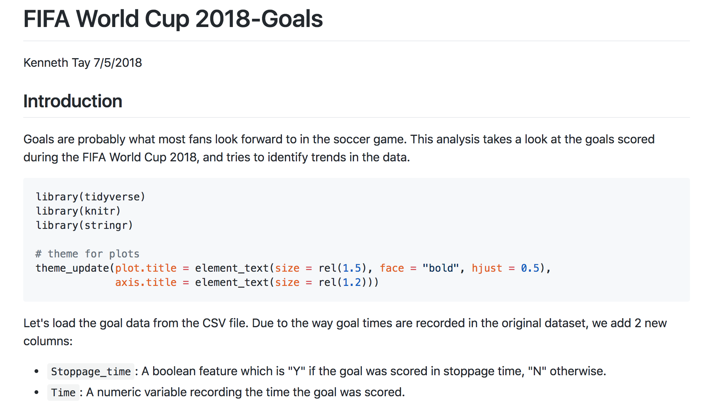
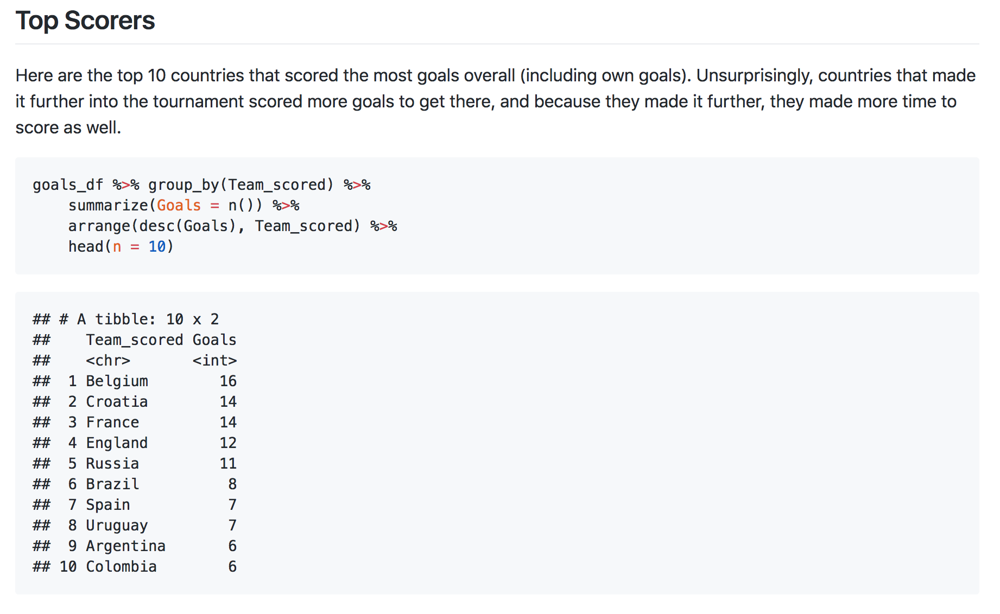
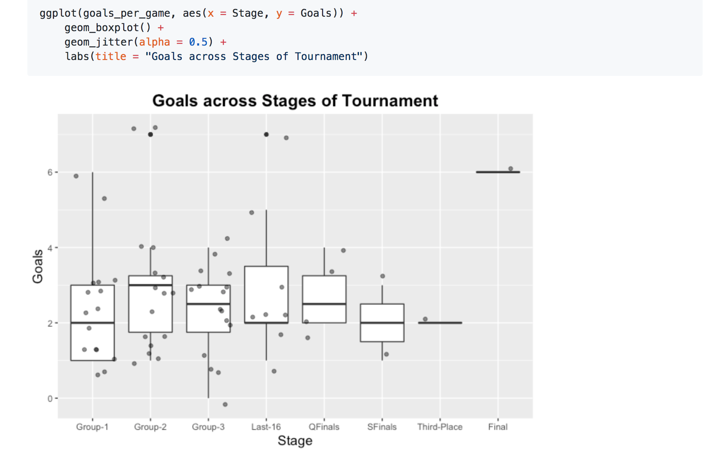
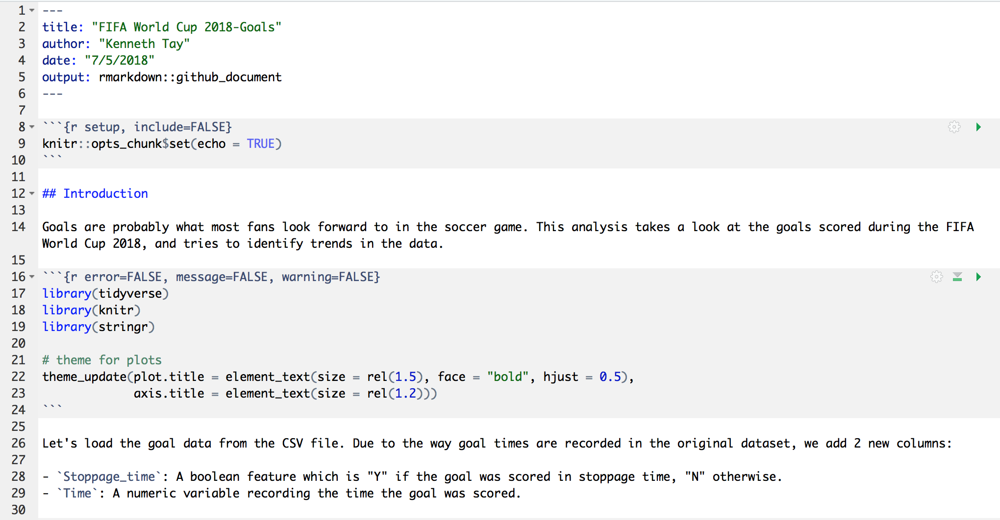

# Recap of session 5  
- Creating projects in R
- Importing your own dataset into R

**Reminder**: Project proposals are due tomorrow night!  

- 1-2 paragraph description of project (datset, problem of interest, potential visualizations)
- Submit text file on Canvas (link to or sample of dataset preferred, not necessary)

# Agenda for today  

- Reproducible research
    - R scripts
    - R markdown  
- More transforming and plotting practice!  

# Reproducible research: what & why

**Reproducible research**: publishing data analyses together with their data and code so that others may "reproduce" the findings.  

**Why reproducible research?**  

- Increase transparency and robustness of analyses
- Preserve integrity of analyses over time
- Reduce incentive for dishonest practices

# R scripts

- An **R script** is a file containing lines of R code that are meant to be run altogether
- R scripts are typically working files, not intended for presentation
- R scripts have `.R` file extensions
- Comments can be inserted to explain the code

# R markdown

[RStudio](http://rmarkdown.rstudio.com/): **R markdown** is a document format which allows you to "weave together narrative text and code to produce elegantly formatted output."

Made possible by the `knitr` package (Yihui Xie)

{width=70%}

(Source: [Vimeo](https://vimeo.com/94181521))

# R markdown: output (1)  

{width=95%}

(Source: [Github: kjytay/FIFA-world-cup-2018](https://github.com/kjytay/FIFA-world-cup-2018/blob/master/Analysis/Goal.md))

# R markdown: output (2)  

{width=95%}

(Source: [Github: kjytay/FIFA-world-cup-2018](https://github.com/kjytay/FIFA-world-cup-2018/blob/master/Analysis/Goal.md))

# R markdown: output (3)  

{width=95%}

(Source: [Github: kjytay/FIFA-world-cup-2018](https://github.com/kjytay/FIFA-world-cup-2018/blob/master/Analysis/Goal.md))

# R markdown: input  

{width=95%}

# R markdown: more details  

- Text (written in Markdown), interspersed with code chunks, "knit" into a document using the `knitr` package
- Typically used for presentation
- R markdown files have `.Rmd` extensions  
- R markdown cheatsheet and reference guide available [here](https://www.rstudio.com/resources/cheatsheets/)

**Surprise:** (Almost) all the class material (including slides) was created with R markdown!

# Quick intro to Markdown

**Markdown** is a simple way to convert a text document into a web file (i.e. HTML) with basic styling.  

Has support for:  

- Headers
- Emphasis (*italics*, **bold**, ~~strikethrough~~)
- Lists
- Links
- Images
- Etc...

Markdown reference [here](https://github.com/adam-p/markdown-here/wiki/Markdown-Cheatsheet).

To see how your Markdown (.md) document looks like in real-time, use an online Markdown editor (e.g. [dillinger.io](https://dillinger.io/))

# Today's dataset: 2016 US Presidential Elections  

{width=80%}

(Source: [Christianity Today  ](https://www.christianitytoday.com/ct/2016/october/clinton-trump-or-neither-3-views-on-2016-presidential-elect.html))

----
        
<b>Optional material</b>

# Rmd workflow (basic)  

1. Edit `.Rmd` file in RStudio.  
2. Knit the document (either by hitting the "Knit" button or using a keyboard shortcut).
    - When you press "Knit", the file is automatically saved.  
    - Next, RStudio opens a new console, "knits" the document there, then closes that console. **No code is run in your original console!**  
    - RStudio creates a `.html` file in the same folder as the `.Rmd` file.
3. Preview output in the preview pane, or by opening the `.html` file.  
    - If you want to make changes, go back to Step 1.

# Rmd workflow (advanced)  

1. Edit `.Rmd` file in RStudio. As you are typing code in the `.Rmd` file, enter this code into the RStudio console to see if it works.  
    - If the code doesn't work, keeping editing the `.Rmd` file until it does.  
2. Periodically knit the document.  
    - When you press "Knit", the file is automatically saved.  
    - Next, RStudio opens a new console, "knits" the document there, then closes that console. **No code is run in your original console!**  
    - If you've done everything correctly, it should knit properly. 
    - If it doesn't, it's probably because you made code changes in the RStudio console which are not reflected in the `.Rmd` file.  Use `rm(list = ls())` to empty your environment, run the code in your `.Rmd` file sequentially in the RStudio console to see what went wrong.

# Common Rmd chunk options  

- `include = FALSE`: prevents code and results from appearing in the finished file. R Markdown still runs the code in the chunk, and the results can be used by other chunks.
    - Useful for decluttering your Rmd output, showing only essential code.
- `echo = FALSE`: prevents code, but not the results from appearing in the finished file.
    - Useful if you just want to show figures but not code that generated it.
- `eval = FALSE`: Code appears in the output but is not run.
    - Useful for presenting code for demonstration purposes.
- `message = FALSE`: prevents messages that are generated by code from appearing in the finished file.
    - Useful for suppressing messages when loading packages.
- `warning = FALSE`: prevents warnings that are generated by code from appearing in the finished.
    - Useful for suppressing warnings when loading packages, plotting data or fitting models.
