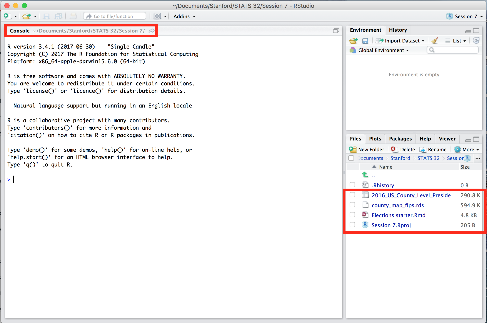
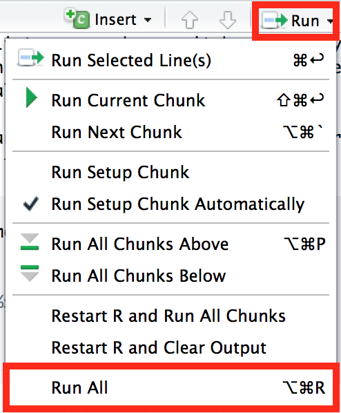

```{r setup, include=FALSE}
knitr::opts_chunk$set(echo = TRUE, eval = FALSE)
```

## Getting started

Create a new project named "Session 7". (For instructions on how to create a new project, see Session 5's code file.) Move these 3 files into the newly created "Session 7" folder (they can be downloaded from the class website):

- `Elections starter.Rmd`
- `2016_US_County_Level_Presidential_Results.csv`
- `county_map_fips.rds`

Your RStudio window should look something like this:

<center>{width=60%}</center>
\

Open `Elections starter.Rmd` by clicking on it in the Files pane. This R markdown file basically contains the work that we did in Session 6. Put your name as author in the YAML header and knit the document. (If the knitting doesn't work, look at the R Markdown console to see what caused the error. It is probably due to files not being in the right place.)

Recall that when we knit a document, R essentially starts a new session/environment and runs all the code there. To replicate the code in our console, click on Run, then Run All: 

<center>{width=30%}</center>
\

(Note: You can't just copy all of the .Rmd file and paste it in the console, since the R console will only understand the parts in the code chunks, not the stuff outside.)

## Saving and reading

At this point, our data frame `df` contains slightly different data in the `diff` and `per_point_diff` columns. This may be something that we want to save to our local drive, so that in the future we can use this file directly, instead of loading the original one and making the changes.

We have 2 options for doing that. The first is to save it as a .csv file with `readr`'s `write_csv` function. Type the following in the console:
```{r}
write_csv(df, "Elections v2.csv")
```

This saves the value of `df` to the file `Elections v2.csv`. (Notice that the file now appears in your working directory in the Files pane.)

The second option is to save it into an `.rds` file. Type the following in the console:
```{r}
saveRDS(df, "Elections data.rds")
```

(The saved file should appear in your working directory.) To read from an `.rds` file, use the `readRDS` function. The code below loads whatever is in `Elections data.rds` and assigns it to the variable `df2`.
```{r}
df2 <- readRDS("Elections data.rds")
```

While `write_csv` only works for data frames, `saveRDS` works for **any** R object.

## Drawing a map of the USA

Let's start by drawing a map of the USA. The `maps` package contains a lot of outlines of continents, countries, states, and counties. `ggplot2`'s `map_data` function puts these outlines in data frame format, which then allows us to plot them with `ggplot`.

Type the following as markdown (i.e. not in a code chunk):
```{r}
## Map of the USA

Let's draw a map of the USA.
```

Create a code chunk and type in the following code:
```{r}
map_USA <- map_data("usa")
head(map_USA)
```

(If the code above doesn't work, it could be that the `maps` package has not been installed yet. Install the `maps` package and try the code above again.) Each row in the `map_USA` dataset is one point on the outline of the USA. We are going to use `ggplot2`'s `geom_polygon` to connect these points.

It terms out that you can't draw a map of the US with just one polygon: there are islands (e.g. Long Island) which form separate polygons. To draw just the "main" mainland, filter as follows:
```{r}
map_USA_main <- map_USA %>% filter(region == "main")
```

In the same code chunk, type the following code:
```{r}
ggplot() +
    geom_polygon(data = map_USA_main, mapping = aes(x = long, y = lat))
```

We get a map! By default, the fill of the polygon is black. Click on the "Zoom" button and resize the window. Do you notice what happens to the map?

In order to keep the correct aspect ratio, amend the code for the map by adding on an extra line:
```{r}
ggplot() +
    geom_polygon(data = map_USA_main, mapping = aes(x = long, y = lat)) + 
    coord_quickmap()
```

Try resizing the window and see the difference in behavior from before.

## Mapping county data

Let's try to map our county map of elections data. Begin a new section in the R markdown document by typing the following in markdown:

```{r}
## Mapping county data
```

It turns out that it's not so easy to get mapping data at the county level with FIPS codes. I've put together a dataset to save you this trouble; load it with the following code (type it in a new code chunk):
```{r}
map_county_fips <- readRDS("county_map_fips.rds")
head(map_county_fips)
```

Let's draw a county map using code that's very similar to what we had for drawing the map of the USA:
```{r}
ggplot() +
    geom_polygon(data = map_county_fips, mapping = aes(x = long, y = lat, group = group)) + 
    coord_quickmap()
```

Create another code chunk. Now, let's draw a map with black outlines for the counties, and different colors for each state:
```{r}
ggplot() +
    geom_polygon(data = map_county_fips,
                 mapping = aes(x = long, y = lat, group = group, fill = region),
                 col = "black") + 
    coord_quickmap() +
    theme(legend.position="none")
```

In order to have the fills of the counties depend on our elections data, we need to somehow get information from our `df` dataset to the `map_county_fips` dataset. We can achieve this by using `dplyr`'s **left-join**.

First, create a new code chunk and extract the columns we need from `df` into a new, smaller data frame:
```{r}
county_per_diff <- df %>% 
    select(fips = combined_fips, percent_diff = per_point_diff)
```

Next, we join this smaller data frame to the mapping data using `left_join` (you can add this code to the same chunk): 
```{r}
# join elections data to mapping data
map_county_per_diff <- map_county_fips %>%
    left_join(county_per_diff, by = "fips")
```

Finally, we use `ggplot` to plot the data:
```{r}
ggplot(data = map_county_per_diff, mapping = aes(x = long, y = lat, group = group)) +
    geom_polygon(aes(fill = percent_diff)) + 
    coord_quickmap() + 
    labs(title = "Election results by county")
```

Great, we got a map! There are two things we can do to improve on it:  

1. The color scale is currently different shades of blue. Something more informative would be counties that voted very Republican being red, those that voted very Democrat being blue, and those that voted evenly being white.
2. The "lat" and "long" axes, as well as the grey background with grid lines, are not helpful for interpreting maps.

Let's change the color scale first. Amend the map plotting code to the following (see `?scale_fill_gradient2` to understand how it works):
```{r}
ggplot(data = map_county_per_diff, mapping = aes(x = long, y = lat, group = group)) +
    geom_polygon(aes(fill = percent_diff)) + 
    scale_fill_gradient2(low = "blue", high = "red") +
    coord_quickmap() + 
    labs(title = "Election results by county")
```

To remove parts of the plot which are not helpful, type in the following code in the same chunk before the `ggplot` call:
```{r}
map_theme <- theme(
    axis.title.x = element_blank(),
    axis.text.x  = element_blank(),
    axis.ticks.x = element_blank(),
    axis.title.y = element_blank(),
    axis.text.y  = element_blank(),
    axis.ticks.y = element_blank(),
    panel.background = element_rect(fill = "white")
)
```

Next, add `map_theme` to the `ggplot` function call:
```{r}
ggplot(data = map_county_per_diff, mapping = aes(x = long, y = lat, group = group)) +
    geom_polygon(aes(fill = percent_diff)) + 
    scale_fill_gradient2(low = "blue", high = "red") +
    coord_quickmap() + 
    labs(title = "Election results by county") +
    map_theme
```

Play around with the labels, theme and color scales. Do any of the counties stand out to you? How can we modify the code above to draw a map of just one state?  

We can see that large parts of the country voted more Republican than Democrat. At the same time, it doesn’t look like 85% of the map is red. This suggests that Trump won many counties which are geographically small.

To make the map better, we could draw state boundaries as well. Create a new code chunk and type in the following code. (Compare this code with the code in the previous chunk and try to figure out how the state boundaries were drawn.)

```{r}
map_state <- map_data("state")
ggplot(data = map_county_per_diff, mapping = aes(x = long, y = lat, group = group)) +
    geom_polygon(aes(fill = percent_diff)) + 
    geom_polygon(data = map_state, fill = NA, color = "black") +
    scale_fill_gradient2(low = "blue", high = "red") +
    coord_quickmap() + 
    labs(title = "Election results by county") + 
    map_theme
```

(If you're curious, that very blue spot in the middle of the country is Oglala County, South Dakota. From [Wikipedia](https://en.wikipedia.org/wiki/Oglala_Lakota_County,_South_Dakota#Politics): "The counties surrounding Oglala Lakota County are predominantly Republican, but, like most Native American counties, Oglala Lakota is heavily Democratic, giving over 75 percent of the vote to every Democratic presidential nominee in every election back to 1984, making it one of the most Democratic counties in the United States. No Republican has carried the county in a presidential election since 1952.") 

## Conclusion section

Every data analysis should have a conclusion section. This can just be a summary of the results presented, or it could also include takeaway lessons, limitations of the analysis and/or future directions.

## Optional: State map

Let's try to make the same map but at the state level, instead of at the county level.

Make a new dataframe containing state-level data:
```{r}
state_df <- df %>% group_by(state_abbr) %>%
    summarize(votes_dem = sum(votes_dem),
              votes_gop = sum(votes_gop),
              total_votes = sum(total_votes)) %>%
    mutate(diff = votes_gop - votes_dem,
           percent_diff = diff / total_votes)
```

Notice that `state_df` and `map_state` contain their data on state differently: it's abbreviated in `state_df`, while its the full name in `map_state`. We'll need to do some data wrangling/transformation to get them to match.

R has 2 built-in variables, `state.abb` and `state.name`, which can help us. First, let's augment these variables with "District of Columbia":
```{r}
state_abb <- c(state.abb, "DC")
state_name <- c(state.name, "District of Columbia")
```

Next, we use the following line of code to add a new column to `state_df` which has the state name in full. (See `?match` to figure out what is going on here. We also have to use `tolower()` as the state names are all in small letters in the `map_state` dataset.)
```{r}
state_df$region <- tolower(state_name[match(state_df$state_abbr, state_abb)])
```

We are now in a position to join the datasets:
```{r}
combined_state_df <- map_state %>% left_join(state_df, by = "region")
```

The commands for plotting are almost the same as for the county map:
```{r}
ggplot(data = combined_state_df, mapping = aes(x = long, y = lat, group = group)) +
    geom_polygon(aes(fill = percent_diff)) + 
    geom_polygon(fill = NA, color = "black") +
    scale_fill_gradient2(low = "blue", high = "red") +
    coord_quickmap() + 
    labs(title = "Election results by state") + 
    map_theme
```

We can also plot the state labels on the map (notice that the `group` can no longer be in the `ggplot()` call):
```{r}
state_names <- combined_state_df %>% group_by(state_abbr) %>%
    summarize(lat = 0.5 * (max(lat) + min(lat)), 
              long = 0.5 * (max(long) + min(long)))

ggplot(data = combined_state_df, mapping = aes(x = long, y = lat)) +
    geom_polygon(aes(group = group, fill = percent_diff)) + 
    geom_polygon(aes(group = group), fill = NA, color = "black") +
    geom_text(data = state_names,
              mapping = aes(x = long, y = lat, label = state_abbr)) +
    scale_fill_gradient2(low = "blue", high = "red") +
    coord_quickmap() + 
    labs(title = "Election results by state") + 
    map_theme
```

## Session info
```{r eval=TRUE}
sessionInfo()
```
