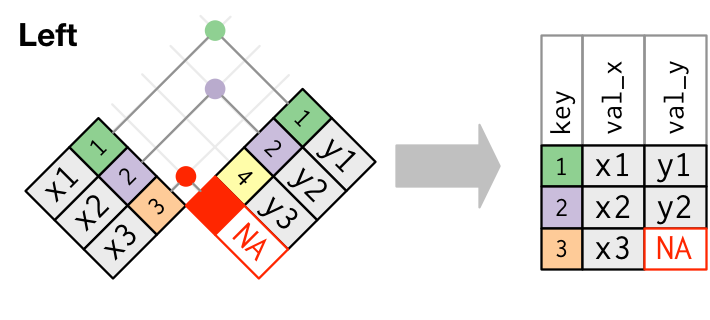
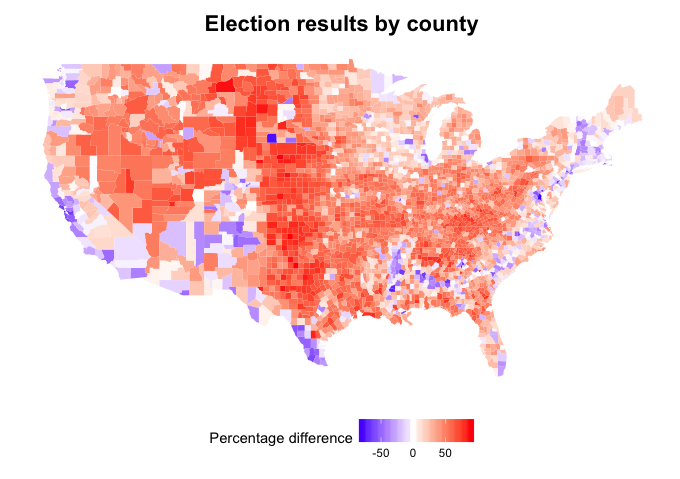

# Announcements

- Final project due next Friday
- Upload as zip file: 1 .Rmd file, knitted HTML file, and if possible, dataset
- Sections:
    - Introduction
    - Getting a feel for your data
    - Data analysis
    - Conclusion

# Recap of week 3

- Creating projects in R
- Importing your own dataset
- R scripts
- R markdown

# Some notes about projects

- You don't need to create a project in order to make R scripts or R markdown files
- Double-clicking on the .Rproj file opens a window, showing where you left off in your project
- Put all project files in the project folder!
- To close a project, click on File > Close Project
    - If that option is grayed out, it means you are not in a project!

# Agenda for today
- Making maps in R
- Joining datasets

# Making maps in R: `maps` package

- `maps` package contains a lot of outlines of continents, countries, states, and counties
- `ggplot2`'s `map_data` function puts these outlines in data frame format, which then allows us to plot them with `ggplot`

# Example: Drawing CA and its counties (1)
```{r message=FALSE, warning=FALSE}
library(ggplot2)
library(maps)
library(dplyr)
library(readr)
```

```{r}
county_data <- map_data("county")
CA_data <- county_data %>% filter(region == "california")
head(CA_data)
```

# Example: Drawing CA and its counties (2)

County outlines are drawn using `geom_polygon`.
```{r}
ggplot(data = CA_data) + 
    geom_polygon(mapping = aes(x = long, y = lat, group = group))
```

# Example: Drawing CA and its counties (3)

`coord_quickmap()` preserves the aspect ratio of the map.
```{r}
ggplot(data = CA_data) + 
    geom_polygon(mapping = aes(x = long, y = lat, group = group)) + 
    coord_quickmap()
```

# Example: Drought levels in CA (1)

```{r message=FALSE}
drought_data <- read_csv("Drought for Session 7.csv")
head(drought_data, n = 3)
```

```{r}
head(CA_data, n = 3)
```

Our drought data and mapping information are in different datasets!

# Example: Drought levels in CA (2)

Solution: Use **joins** (in `dplyr` package).

```{r}
combined_data <- CA_data %>%
    left_join(drought_data, by = c("subregion" = "County"))
```

<center>


</center>

# Example: Drought levels in CA (3)

```{r}
head(combined_data)
```

# Example: Drought levels in CA (4)

Map the `fill` attribute of `geom_polygon` to the `Drought_percent` column.
```{r}
ggplot(data = combined_data) + 
    geom_polygon(mapping = aes(x = long, y = lat, 
            group = group, fill = Drought_percent)) + 
    coord_quickmap()
```

# Example: Drought levels in CA (5)

Use `scale_fill_distiller` to define a more appropriate color scale.
```{r}
ggplot(data = combined_data) + 
    geom_polygon(mapping = aes(x = long, y = lat, 
            group = group, fill = Drought_percent)) + 
    scale_fill_distiller(palette = "YlOrRd", direction = 1) +
    coord_quickmap()
```

# Today's dataset: 2016 US Presidential Elections  

<center>
{width=80%}
</center>

----
<br><br><br><br><br><br><br><br>
<font size = 36><b>Optional material</b></font>

# Other types of joins  

*Inner join*: Matches pairs of observations with equal keys, drops everything else. Hence, only keeps observations which appear in both datasets.

<center>

</center>

# Other types of joins

After matching pairs of observations with equal keys...  

- *Left join*: Keeps all observations in the left dataset, drops everything unmatched in the right dataset.  
- *Right join*: Keeps all observations in the right dataset, drops everything unmatched in the left dataset.  
- *Full join*: Keeps all observations in both datasets.  

<center>

</center>