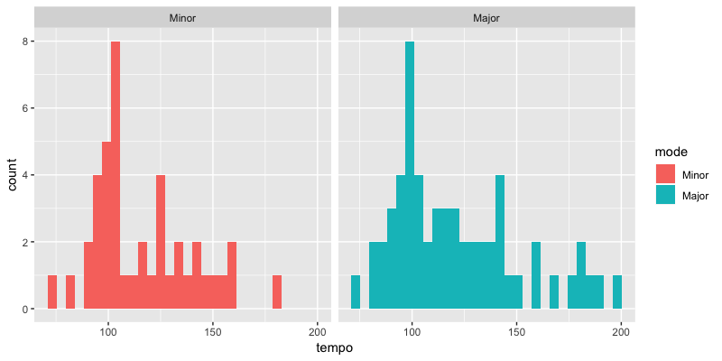
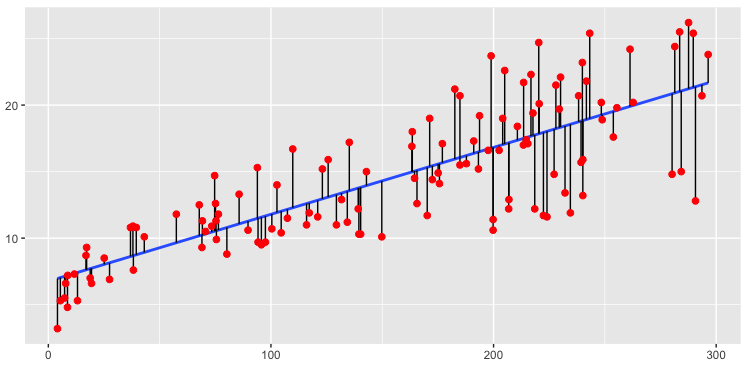

# Announcements

Project due on **2 Nov (Fri) 23:59:59**

Remaining office hours:

- 26 Oct (tomorrow)
- 2 Nov (Fri)

10am-12pm, Sequoia Hall Rm 207

# Recap of session 7
- Making maps in R
    - `geom_polygon`
    - `aes(x = long, y = lat, group = group)`
- Joining datasets with `left_join`
    - `df1 %>% left_join(df2, by = "key")`

# Agenda for today
- A crash course in statistics and modeling
    - Hypothesis testing
    - Linear regression

A very high level picture: for technical details, take STATS 60/STATS 101

# Today's dataset: Top 100 songs on Spotify  

<center>
{width=90%}
<div class="caption">(Source: [Spotify](https://open.spotify.com/playlist/37i9dQZF1DX5nwnRMcdReF))
</center>

# Tempo by mode: Is there a difference?

Hard to tell from the histograms:

<center>{width=80%}</center>

# Look at mean tempo for each mode

- Major: $\approx 122$ bpm
- Minor: $\approx 116$ bpm

Is this difference significant? What do we mean by significance anyway?

# Structure of a hypothesis test

1. Start with a **null hypothesis**: An assumption on how the data is generated

# Structure of a hypothesis test

1. Start with a **null hypothesis**: An assumption on how the data is generated  
2. Based on this assumption, how likely were we to collect data as extreme as what we have?
    - **p-value**: probability of collecting data as extreme as ours (if null hypothesis is true)

# Structure of a hypothesis test

1. Start with a **null hypothesis**: An assumption on how the data is generated  
2. Based on this assumption, how likely were we to collect data as extreme as what we have?
    - **p-value**: probability of collecting data as extreme as ours (if null hypothesis is true)
3. Is the p-value considered low or not?
    - Threshold should depend on the context
    - Typical thresholds, 0.1, 0.05, 0.01

# Structure of a hypothesis test

1. Start with a **null hypothesis**: An assumption on how the data is generated  
2. Based on this assumption, how likely were we to collect data as extreme as what we have?
    - **p-value**: probability of collecting data as extreme as ours (if null hypothesis is true)
3. Is the p-value considered low or not?
    - Threshold should depend on the context
    - Typical thresholds, 0.1, 0.05, 0.01
4. If p-value is below threshold, 2 possible conclusions:
    - A rare event just happened, or
    - Our assumption in Step 1 was false

# Tempo by mode: Is there a difference?
Two options:

- $t$-test
    - **Null hypothesis**: Mean tempo for songs in minor key is the same as that for songs in major key
    - Makes more assumptions on the data generation process ("*parametric* test")
- Kolmogorov-Smirnov test
    - **Null hypothesis**: The distribution of tempo for songs in minor key is the same as that for songs in major key
    - Less assumptions on data generation process ("*non-parametric* test"), but rejecting the null gives less information

# What is a model?

- A **model** is a simplified and idealized way to understand a system.
- [R4DS](http://r4ds.had.co.nz/model-intro.html): "The goal of a model is to provide a simple low-dimensional summary of a dataset. Ideally, the model will capture true “signals” (i.e. patterns generated by the phenomenon of interest), and ignore “noise” (i.e. random variation that you’re not interested in)."

# Two steps to modeling

### Step 1: Identify a family of models which express a generic pattern between your variables of interest.

```{r include=FALSE}
library(HistData)
library(ggplot2)
df <- PearsonLee
```
<center>
```{r echo=FALSE, fig.width=4, fig.height=3}
ggplot(data = df, aes(x = parent, y = child)) + 
    geom_jitter(alpha = 1/3, width = 0.3, height = 0.3)
```
</center>
Possible model family: Linear model, i.e. $child = a_1 + a_2 \times parent$.

- Variables: `child` and `parent`
- Model parameters: $a_1$ and $a_2$

Many other possible models: linear without intercept, quadratic, exponential, ... 

# Different models within the linear model family

Each line corresponds to a choice of $a_1$ and $a_2$.
<center>
```{r echo=FALSE, fig.width=7, fig.height=5}
set.seed(1245)
models <- data.frame(m = runif(50, -3, 3))
models$c <- -models$m * runif(50, 55, 75) + runif(50, 50, 70)

fit <- lm(child ~ parent, data = df)

p <- ggplot(data = df, aes(x = parent, y = child)) +
    geom_jitter(alpha = 1/3, width = 0.3, height = 0.3) +
    geom_abline(aes(intercept = c, slope = m), data = models, alpha = 1/4)
p + geom_abline(aes(intercept = coef(fit)[1], slope = coef(fit)[2]), alpha = 1/4)
```
</center>

# Two steps to modeling

### Step 2: Find the model in this family that most closely matches your data.

That is, find specific values of $a_1$ and $a_2$ which make the model match the data most closely.

<center>
```{r echo=FALSE, fig.width=6, fig.height=4}
p + geom_abline(aes(intercept = coef(fit)[1], slope = coef(fit)[2]), 
                col = "blue", size = 1.5)
```
</center>

# What do we mean by "closely matching the data"?

We choose $a_1$ and $a_2$ such that some objective function (**loss function**) is minimized.

Most common objective: Minimize the sum of squares of the black lines below.

<center>
{width=75%}
<div class="caption">(Source: [uc-r.github.io](http://uc-r.github.io/linear_regression))
</center>

# Linear models in R

- Linear regression can be done with the `lm` function
- Syntax: `lm(formula, data = df)`
- Formulas look like `y ~ x`, which `lm` will translate to a function like $y = a_1 + a_2 \cdot x$

# Models with categorical variables

Consider modeling `valence ~ mode`.

- Does the model $valence = a_1 + a_2 \cdot mode$ make sense?
    - 3 + 4 $\cdot$ "Major"?? 
- What R does:
    - Choose a baseline category (say, "Minor")
    - Model $valence = a_1 + a_2 \cdot modeMajor$, where $modeMajor = \begin{cases} 1 &\text{if "Major"}, \\ 0 &\text{if "Minor"}. \end{cases}$
- $valence = a_1$ if Minor, $valence = a_1 + a_2$ if Major

# Additive models

Formula `valence ~ loudness + mode` translates to

- $valence = a_1 + a_2 \cdot loudness + a_3 \cdot modeMajor$, where $modeMajor = \begin{cases} 1 &\text{if "Major"}, \\ 0 &\text{if "Minor"}. \end{cases}$
- $valence = a_1 + a_2 \cdot loudness$ if Minor
- $valence = (a_1 + a_3) + a_2 \cdot loudness$ if Major
- Same gradient, different intercept

# Models with interaction

Formula `valence ~ loudness * mode` translates to

- $valence = a_1 + a_2 \cdot loudness + a_3 \cdot modeMajor + \color{blue}{a_4 \cdot loudness \cdot modeMajor}$, where $modeMajor = \begin{cases} 1 &\text{if "Major"}, \\ 0 &\text{if "Minor"}. \end{cases}$
- $valence = a_1 + a_2 \cdot loudness$ if Minor
- $valence = (a_1 + a_3) + (a_2 + a_4) \cdot loudness$ if Major
- Different gradient, different intercept

# Summary of the course

- Variable types
- Basic objects in R (vectors, lists, data frames)
- Plotting data with `ggplot2`
- Transforming and joining data with `dplyr`
- Importing and exporting data
- R projects, R scripts and R markdown
- Making maps
- Basic statistical testing and modeling

# Where do we go from here?

- Read [R for Data Science](http://r4ds.had.co.nz/) from cover to cover!
- Take short courses on [DataCamp](https://www.datacamp.com/onboarding/learn?from=home&technology=r)
- Writing your own functions and running simulations
- Advanced mapping with `ggmap`
- Advanced regression models with `glmnet`
- Interactive web apps with `shiny`
- Text analysis with `tidytext`
    - Recommmended text: *Text Mining with R* by Julia Silge and David Robinson (avaible online for free at [tidytextmining.com](http://tidytextmining.com/))

# Other Stanford courses

- Programming: CS 106A
- Statistical methods: STATS 60, STATS 101

# Thank you! :)

